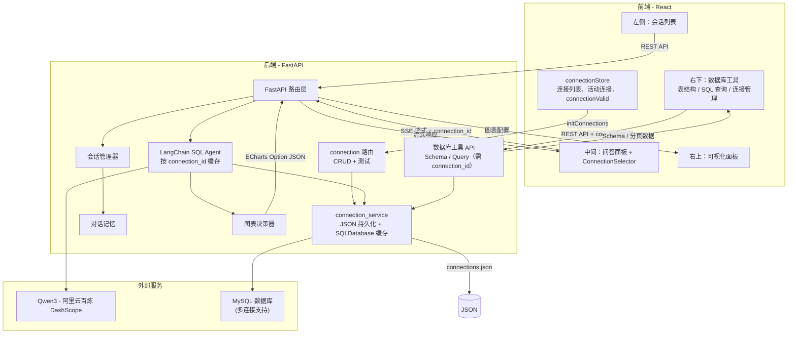
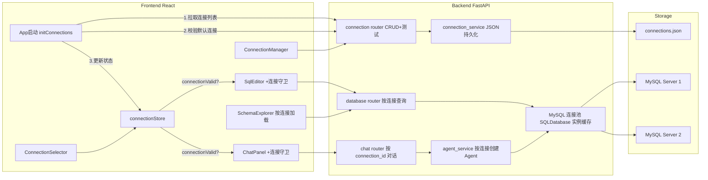
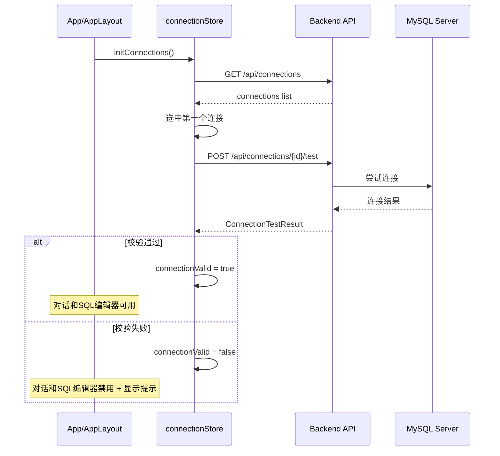

# NL2SQL 智能数据分析系统 - MySQL 版本

> **运行环境**：conda 虚拟环境 `nl2sql_vc`，Python 3.11
> **数据存储**：MySQL（PyMySQL + SQLAlchemy），支持多连接管理
> **项目路径**：`g:\nl2sql_agent\`

---

## 系统整体架构




---

## MySQL 连接管理架构




**启动校验时序**：




---

## 项目目录结构

```
g:\nl2sql_agent\
├── backend/
│   ├── app/
│   │   ├── main.py                 # FastAPI 入口，挂载 session/chat/database/connection 路由
│   │   ├── config.py               # MYSQL_* 默认连接参数、CONNECTIONS_FILE
│   │   ├── routers/
│   │   │   ├── chat.py             # 聊天 SSE（请求体含 connection_id）
│   │   │   ├── session.py          # 会话 CRUD
│   │   │   ├── database.py         # Schema + Query（query 参数 connection_id）
│   │   │   └── connection.py       # 连接管理 CRUD + 测试
│   │   ├── services/
│   │   │   ├── llm_service.py
│   │   │   ├── agent_service.py    # 按 connection_id 管理 Agent 缓存
│   │   │   ├── session_service.py
│   │   │   ├── chart_service.py
│   │   │   └── connection_service.py  # 连接 CRUD、SQLDatabase 缓存、连接测试
│   │   ├── models/schemas.py       # 含 MySQLConnectionConfig、ConnectionTestResult、connection_id
│   │   ├── database/
│   │   │   └── connection.py       # MySQL 连接工厂（build_mysql_uri、create_sql_database）
│   │   └── playground/
│   │       ├── test_mysql_connection.py  # Phase5 全流程测试（79 项）
│   │       └── ...
│   ├── data/
│   │   └── connections.json        # 连接配置持久化
│   ├── requirements.txt           # 含 pymysql
│   └── .env                        # MYSQL_HOST、MYSQL_PORT、MYSQL_USER、MYSQL_PASSWORD、MYSQL_DATABASE
├── frontend/
│   ├── src/
│   │   ├── api/client.ts           # 含 fetchConnectionsApi、testConnectionByIdApi 等，现有 API 传 connectionId
│   │   ├── types/index.ts          # 含 MySQLConnection、ConnectionTestResult 等
│   │   ├── stores/
│   │   │   ├── sessionStore.ts
│   │   │   ├── chatStore.ts        # sendMessage(sessionId, content, connectionId)
│   │   │   └── connectionStore.ts # 连接列表、活动连接、connectionValid、initConnections
│   │   └── components/
│   │       ├── AppLayout.tsx       # initConnections、loading/error 横幅、effectiveConnectionId
│   │       ├── Connection/
│   │       │   ├── ConnectionManager.tsx
│   │       │   ├── ConnectionDialog.tsx
│   │       │   └── ConnectionSelector.tsx
│   │       └── Database/
│   │           ├── DatabasePanel.tsx   # 三 Tab：表结构/SQL查询/连接管理 + ConnectionSelector
│   │           ├── SchemaExplorer.tsx # connectionId prop，无效时占位
│   │           └── SqlEditor.tsx      # connectionId prop，连接守卫
│   └── ...
└── ...
```

---

## 任务清单总览


| Phase       | 任务 ID                  | 任务内容                                                                           | 状态          |
| ----------- | ---------------------- | ------------------------------------------------------------------------------ | ----------- |
| **Phase 1** | p1-backend-scaffold    | 后端基础骨架                                                                         | ✅ completed |
| **Phase 1** | p1-backend-run         | 启动后端服务验证                                                                       | ✅ completed |
| **Phase 1** | p1-frontend-scaffold   | 前端基础骨架                                                                         | ✅ completed |
| **Phase 1** | p1-frontend-run        | 启动前端服务验证                                                                       | ✅ completed |
| **Phase 2** | p2-layout              | 前端三栏布局                                                                         | ✅ completed |
| **Phase 2** | p2-sidebar             | 左侧边栏 UI                                                                        | ✅ completed |
| **Phase 2** | p2-chat-ui             | 中间聊天面板 UI                                                                      | ✅ completed |
| **Phase 2** | p2-chart-ui            | 右侧图表面板 UI                                                                      | ✅ completed |
| **Phase 2** | p2-stores              | Zustand 状态管理                                                                   | ✅ completed |
| **Phase 3** | p3-llm-service         | 后端 LLM 服务                                                                      | ✅ completed |
| **Phase 3** | p3-mysql-connection    | MySQL 连接管理（config、connection、connection_service、connection 路由）                 | ✅ completed |
| **Phase 3** | p3-agent-service       | 后端 SQL Agent（按 connection_id 缓存）                                               | ✅ completed |
| **Phase 3** | p3-session-api         | 后端会话接口                                                                         | ✅ completed |
| **Phase 3** | p3-chart-service       | 后端图表服务                                                                         | ✅ completed |
| **Phase 3** | p3-chat-stream-api     | 后端聊天流式接口（含 connection_id）                                                      | ✅ completed |
| **Phase 4** | p4-api-client          | 前端 API 对接（含连接管理 API）                                                           | ✅ completed |
| **Phase 4** | p4-session-integration | 会话联调                                                                           | ✅ completed |
| **Phase 4** | p4-chat-integration    | 聊天联调（传入 connectionId）                                                          | ✅ completed |
| **Phase 4** | p4-chart-integration   | 图表联调                                                                           | ✅ completed |
| **Phase 4** | p4-e2e-test            | 端到端验证                                                                          | ✅ completed |
| **Phase 5** | p5-db-backend-api      | 后端数据库工具 API（connection_id 必填）                                                  | ✅ completed |
| **Phase 5** | p5-db-frontend-types   | 前端类型 + API（含连接类型、connectionId）                                                 | ✅ completed |
| **Phase 5** | p5-connection-ui       | 连接管理 UI（connectionStore、ConnectionManager、ConnectionDialog、ConnectionSelector） | ✅ completed |
| **Phase 5** | p5-db-schema-explorer  | SchemaExplorer（按 connectionId 加载）                                              | ✅ completed |
| **Phase 5** | p5-db-sql-editor       | SqlEditor + QueryResult（连接守卫）                                                  | ✅ completed |
| **Phase 5** | p5-db-panel-layout     | DatabasePanel + AppLayout（连接守卫）                                                | ✅ completed |
| **Phase 5** | p5-app-init            | App 启动校验 initConnections                                                       | ✅ completed |
| **Phase 5** | p5-backend-test        | 后端测试 test_mysql_connection.py                                                  | ✅ completed |
| **Phase 5** | p5-e2e-test            | 前端联调测试                                                                         | ✅ completed |
| **Phase 6** | p6-markdown            | AI 回复 Markdown 渲染                                                              | ✅ completed |
| **Phase 6** | p6-collapsible         | 中间过程折叠                                                                         | ✅ completed |
| **Phase 6** | p6-thinking-process    | 思考过程优化                                                                         | ✅ completed |
| **Phase 6** | p6-chart-ux            | 图表体验优化                                                                         | ✅ completed |
| **Phase 6** | p6-tech-theme          | 科技主题 UI                                                                        | ✅ completed |


---

## 配置与环境

### 后端 config.py（MySQL 版本）

```python
class Settings(BaseSettings):
    DASHSCOPE_API_KEY: str = "sk-xxxxx"
    LLM_MODEL_NAME: str = "qwen3-max"
    LLM_BASE_URL: str = "https://dashscope.aliyuncs.com/compatible-mode/v1"
    LLM_TEMPERATURE: float = 0.7

    # MySQL 默认连接（可通过 .env 覆盖）
    MYSQL_HOST: str = "localhost"
    MYSQL_PORT: int = 3306
    MYSQL_USER: str = "root"
    MYSQL_PASSWORD: str = ""
    MYSQL_DATABASE: str = ""

    # 连接配置持久化路径
    CONNECTIONS_FILE: str = "./data/connections.json"
```

### backend/.env

```
DASHSCOPE_API_KEY=sk-xxxxx
LLM_MODEL_NAME=qwen3-max
LLM_BASE_URL=https://dashscope.aliyuncs.com/compatible-mode/v1
MYSQL_HOST=localhost
MYSQL_PORT=3306
MYSQL_USER=root
MYSQL_PASSWORD=xxxxx
MYSQL_DATABASE=ai_sales_data
```

---

## 连接管理 API


| 方法     | 路径                           | 描述               |
| ------ | ---------------------------- | ---------------- |
| GET    | `/api/connections`           | 获取所有连接列表         |
| POST   | `/api/connections`           | 新增连接             |
| GET    | `/api/connections/{id}`      | 获取单个连接           |
| PUT    | `/api/connections/{id}`      | 更新连接             |
| DELETE | `/api/connections/{id}`      | 删除连接             |
| POST   | `/api/connections/test`      | 测试连接（不保存，传入完整配置） |
| POST   | `/api/connections/{id}/test` | 测试已保存的连接         |


---

## 数据库与聊天 API（需 connection_id）


| 方法   | 路径                                    | 说明                                            |
| ---- | ------------------------------------- | --------------------------------------------- |
| GET  | `/api/database/schema?connection_id=` | 获取指定连接的表结构                                    |
| POST | `/api/database/query`                 | 请求体含 `connection_id`、`sql`、`page`、`page_size` |
| POST | `/api/chat/{session_id}/stream`       | 请求体含 `message`、`connection_id`                |


---

## Phase 5 测试验证报告

### 后端测试 - test_mysql_connection.py

**运行方式**：`cd backend && python -m app.playground.test_mysql_connection`

**测试结果**：


| 模块                   | 通过     | 失败    | 状态           |
| -------------------- | ------ | ----- | ------------ |
| Part 1: 健康检查         | 2      | 0     | OK           |
| Part 2: 连接测试功能       | 10     | 0     | OK           |
| Part 3: 连接 CRUD      | 22     | 0     | OK           |
| Part 4: Schema 获取    | 10     | 0     | OK           |
| Part 5: SQL 查询执行     | 17     | 0     | OK           |
| Part 6: SSE 聊天流式接口   | 9      | 0     | OK           |
| Part 7: 会话消息持久化      | 6      | 0     | OK           |
| Part 8: 多连接 Agent 隔离 | 3      | 0     | OK           |
| **合计**               | **79** | **0** | **ALL PASS** |


### 前端联调验证


| 检查项                       | 状态   |
| ------------------------- | ---- |
| 启动校验 initConnections      | PASS |
| 连接守卫（无有效连接时禁用）            | PASS |
| 连接管理（新增、测试、删除）            | PASS |
| Schema 按连接加载              | PASS |
| SQL 编辑器按连接执行              | PASS |
| 对话区域选择连接                  | PASS |
| 切换连接重新校验                  | PASS |
| 前端构建 tsc -b && vite build | PASS |


---

## 涉及文件变更清单（MySQL 版本）

### 后端 - 修改


| 文件                        | 变更描述                                                                                      |
| ------------------------- | ----------------------------------------------------------------------------------------- |
| config.py                 | 移除 DB_PATH，新增 MYSQL_* 和 CONNECTIONS_FILE                                                  |
| models/schemas.py         | 新增 MySQLConnectionConfig、ConnectionTestResult，ChatRequest/SqlQueryRequest 含 connection_id |
| database/connection.py    | 重写为 MySQL 连接工厂                                                                            |
| routers/database.py       | 移除 sqlite3，使用 SQLAlchemy inspect + connection_id                                          |
| services/agent_service.py | 按 connection_id 管理 Agent 缓存                                                               |
| routers/chat.py           | ChatRequest 含 connection_id                                                               |
| main.py                   | 移除 SQLite 初始化，挂载 connection 路由                                                            |


### 后端 - 新增


| 文件                                  | 描述                          |
| ----------------------------------- | --------------------------- |
| services/connection_service.py      | 连接 CRUD、SQLDatabase 缓存、连接测试 |
| routers/connection.py               | 连接管理 REST API               |
| playground/test_mysql_connection.py | 全流程测试脚本                     |


### 前端 - 修改


| 文件                  | 变更描述                                                                    |
| ------------------- | ----------------------------------------------------------------------- |
| types/index.ts      | 新增 MySQLConnection、ConnectionTestResult 等                               |
| api/client.ts       | 新增连接 API，fetchSchemaApi/executeSqlApi/sendChatMessageApi 含 connectionId |
| stores/chatStore.ts | sendMessage(sessionId, content, connectionId)                           |
| AppLayout.tsx       | initConnections、loading/error 横幅、effectiveConnectionId                  |
| ChatPanel.tsx       | ConnectionSelector、connectionId 透传                                      |
| ChatInput.tsx       | connectionId、连接守卫                                                       |
| DatabasePanel.tsx   | 三 Tab、ConnectionSelector、connectionId 透传                                |
| SchemaExplorer.tsx  | connectionId、无效占位                                                       |
| SqlEditor.tsx       | connectionId、连接守卫                                                       |


### 前端 - 新增


| 文件                                           | 描述      |
| -------------------------------------------- | ------- |
| stores/connectionStore.ts                    | 连接状态管理  |
| components/Connection/ConnectionManager.tsx  | 连接管理面板  |
| components/Connection/ConnectionDialog.tsx   | 连接编辑弹窗  |
| components/Connection/ConnectionSelector.tsx | 连接下拉选择器 |


---

## 核心依赖

### 后端（requirements.txt）

- `fastapi` + `uvicorn[standard]`
- `langchain` + `langchain-openai` + `langchain-community`
- `python-dotenv` + `pydantic` + `pydantic-settings`
- `sse-starlette`
- `pymysql`  # MySQL 驱动

### 前端（package.json）

- `react` + `react-dom` + `vite` + `typescript`
- `tailwindcss` + `@tailwindcss/vite`
- `zustand` + `axios` + `uuid`
- `echarts` + `echarts-for-react`
- `react-markdown` + `remark-gfm`

