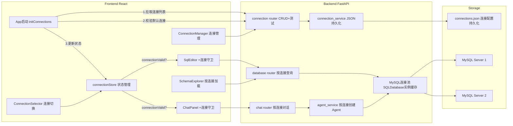
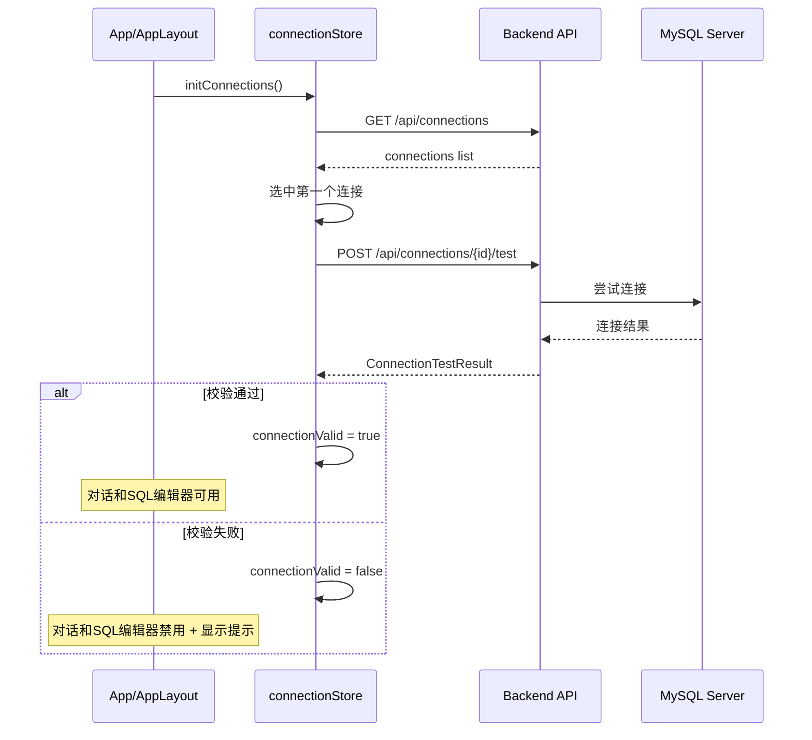

# NL2SQL MySQL 版本规划

## 概述

将现有 SQLite3 版本完全迁移为 MySQL 版本，核心变更：

- 移除所有 SQLite3 相关代码，全面使用 MySQL (PyMySQL + SQLAlchemy)
- 新增多 MySQL 服务器连接管理（支持不同 host:port 的连接配置，CRUD + 测试）
- SQL 编辑器和对话区域均可选择/切换不同数据库连接
- **前端启动时自动校验默认连接**：加载连接列表 -> 选中默认连接 -> 测试连通性 -> 标记 valid/invalid
- **连接守卫**：只有选中有效连接后，对话输入和 SQL 编辑器查询功能才可用；未选中或连接无效时禁用并提示
- 其余功能（SSE 流式、思考过程、图表、Markdown 渲染、科技主题）保持不变

## 架构变更总览




**启动校验时序**：




---

## Phase 1: 后端 - MySQL 连接管理服务

### 1.1 配置更新 - `backend/app/config.py`

移除 `DB_PATH`，添加 MySQL 默认连接参数：

```python
class Settings(BaseSettings):
    DASHSCOPE_API_KEY: str = "sk-xxxxx"
    LLM_MODEL_NAME: str = "qwen3-max"
    LLM_BASE_URL: str = "https://dashscope.aliyuncs.com/compatible-mode/v1"
    LLM_TEMPERATURE: float = 0.7

    # MySQL 默认连接（可通过 .env 覆盖）
    MYSQL_HOST: str = "localhost"
    MYSQL_PORT: int = 3306
    MYSQL_USER: str = "root"
    MYSQL_PASSWORD: str = ""
    MYSQL_DATABASE: str = ""

    # 连接配置持久化路径
    CONNECTIONS_FILE: str = "./data/connections.json"
```

### 1.2 数据模型 - `backend/app/models/schemas.py`

新增连接相关 Pydantic 模型：

```python
class MySQLConnectionConfig(BaseModel):
    """MySQL 连接配置"""
    id: Optional[str] = Field(default=None, description="连接 ID（创建时自动生成）")
    name: str = Field(..., description="连接名称，如：生产库-销售数据")
    host: str = Field(..., description="MySQL 主机地址")
    port: int = Field(default=3306, description="MySQL 端口")
    user: str = Field(..., description="用户名")
    password: str = Field(..., description="密码")
    database: str = Field(..., description="数据库名")

class ConnectionTestResult(BaseModel):
    """连接测试结果"""
    success: bool
    message: str
    mysql_version: Optional[str] = None
    tables_count: Optional[int] = None

class ConnectionListResponse(BaseModel):
    """连接列表响应"""
    connections: list[MySQLConnectionConfig]
```

### 1.3 连接服务 - 新建 `backend/app/services/connection_service.py`

核心职责：

- 连接配置 CRUD（持久化到 `connections.json`）
- 根据 connection_id 构建 `mysql+pymysql://` URI
- 维护 `SQLDatabase` 实例缓存（`dict[str, SQLDatabase]`）
- 连接测试（验证连通性、获取 MySQL 版本和表数量）

关键方法：

- `list_connections() -> list[MySQLConnectionConfig]`
- `get_connection(conn_id: str) -> MySQLConnectionConfig`
- `add_connection(config: MySQLConnectionConfig) -> MySQLConnectionConfig`
- `update_connection(conn_id: str, config) -> MySQLConnectionConfig`
- `delete_connection(conn_id: str) -> bool`
- `test_connection(config: MySQLConnectionConfig) -> ConnectionTestResult`
- `get_sql_database(conn_id: str) -> SQLDatabase`（带缓存，连接配置变更时清除）

### 1.4 连接重写 - `backend/app/database/connection.py`

完全重写，移除 SQLite 逻辑，改为 MySQL 连接工厂：

```python
from langchain_community.utilities import SQLDatabase

def build_mysql_uri(host, port, user, password, database) -> str:
    return f"mysql+pymysql://{user}:{password}@{host}:{port}/{database}?charset=utf8mb4"

def create_sql_database(host, port, user, password, database) -> SQLDatabase:
    uri = build_mysql_uri(host, port, user, password, database)
    return SQLDatabase.from_uri(uri)
```

### 1.5 连接路由 - 新建 `backend/app/routers/connection.py`

API 端点：


| 方法     | 路径                           | 描述               |
| ------ | ---------------------------- | ---------------- |
| GET    | `/api/connections`           | 获取所有连接列表         |
| POST   | `/api/connections`           | 新增连接             |
| PUT    | `/api/connections/{id}`      | 更新连接             |
| DELETE | `/api/connections/{id}`      | 删除连接             |
| POST   | `/api/connections/test`      | 测试连接（不保存，传入完整配置） |
| POST   | `/api/connections/{id}/test` | 测试已保存的连接         |


---

## Phase 2: 后端 - 数据库工具 API 和 Agent 适配

### 2.1 数据库路由改造 - `backend/app/routers/database.py`

核心变更：

- 移除所有 `sqlite3` 模块引用和 `_get_raw_connection()`
- Schema 和 Query 接口添加 `connection_id` 参数
- 使用 `connection_service.get_sql_database(conn_id)` 获取 SQLDatabase 实例
- Schema 查询改用 SQLAlchemy `inspect()` 代替 `PRAGMA table_info`
- SQL 执行改用 `sqlalchemy.text()` + `engine.connect()`

```python
from sqlalchemy import inspect, text

@router.get("/schema")
async def get_schema(connection_id: str):
    db = connection_service.get_sql_database(connection_id)
    engine = db._engine
    inspector = inspect(engine)
    # 使用 inspector.get_table_names() + inspector.get_columns()
    ...

@router.post("/query")
async def execute_query(body: SqlQueryRequest):
    # body 新增 connection_id 字段
    db = connection_service.get_sql_database(body.connection_id)
    engine = db._engine
    with engine.connect() as conn:
        result = conn.execute(text(count_sql))
        ...
```

`SqlQueryRequest` 模型新增 `connection_id: str` 字段。

### 2.2 Agent 服务改造 - `backend/app/services/agent_service.py`

核心变更：

- 不再使用全局单例 Agent，改为按 connection_id 维护 Agent 缓存
- `get_agent(connection_id: str)` 根据连接获取或创建 Agent
- SYSTEM_PROMPT 中的 `{dialect}` 固定为 `mysql`

```python
_agents: dict[str, Any] = {}  # connection_id -> agent
_checkpointers: dict[str, InMemorySaver] = {}

def get_agent(connection_id: str):
    if connection_id not in _agents:
        db = connection_service.get_sql_database(connection_id)
        llm = get_llm()
        toolkit = SQLDatabaseToolkit(db=db, llm=llm)
        checkpointer = InMemorySaver()
        agent = create_agent(llm, toolkit.get_tools(), ...)
        _agents[connection_id] = agent
        _checkpointers[connection_id] = checkpointer
    return _agents[connection_id]
```

### 2.3 聊天路由改造 - `backend/app/routers/chat.py`

- `ChatRequest` 新增 `connection_id: str` 字段
- `_stream_agent_response` 接收 `connection_id`，传递给 `get_agent(connection_id)`

### 2.4 入口改造 - `backend/app/main.py`

- 移除 `from app.database.sample_data import init_sample_database` 及 lifespan 中的 SQLite 初始化
- 新增 `from app.routers import connection` 并挂载 `connection.router`
- lifespan 中可初始化默认连接（从 .env 读取 MYSQL_* 配置，自动创建一条默认连接）

### 2.5 环境配置 - `backend/.env`

```
DASHSCOPE_API_KEY=sk-18bc9910dfd540bfa95df545f76d7fb2
LLM_MODEL_NAME=qwen3-max
LLM_BASE_URL=https://dashscope.aliyuncs.com/compatible-mode/v1
MYSQL_HOST=localhost
MYSQL_PORT=3306
MYSQL_USER=root
MYSQL_PASSWORD=csd123456
MYSQL_DATABASE=ai_sales_data
```

### 2.6 依赖更新 - `backend/requirements.txt`

确保包含 `pymysql`（已在上一版本添加），移除 SQLite 相关无用依赖（如有）。

---

## Phase 3: 前端 - 连接管理 UI

### 3.1 类型定义 - `frontend/src/types/index.ts`

新增：

```typescript
/** MySQL 连接配置 */
export interface MySQLConnection {
  id: string
  name: string
  host: string
  port: number
  user: string
  password: string
  database: string
}

/** 连接测试结果 */
export interface ConnectionTestResult {
  success: boolean
  message: string
  mysql_version?: string | null
  tables_count?: number | null
}
```

### 3.2 API 层 - `frontend/src/api/client.ts`

新增连接管理 API 方法：

```typescript
// 连接管理 API
export async function fetchConnectionsApi(): Promise<MySQLConnection[]>
export async function addConnectionApi(config: Omit<MySQLConnection, 'id'>): Promise<MySQLConnection>
export async function updateConnectionApi(id: string, config: ...): Promise<MySQLConnection>
export async function deleteConnectionApi(id: string): Promise<void>
export async function testConnectionApi(config: ...): Promise<ConnectionTestResult>
```

修改现有 API：

- `fetchSchemaApi(connectionId: string)` - 增加 connectionId 参数
- `executeSqlApi(sql, page, pageSize, connectionId)` - 增加 connectionId
- `sendChatMessageApi(sessionId, message, callbacks, connectionId)` - 增加 connectionId

### 3.3 连接状态管理 - 新建 `frontend/src/stores/connectionStore.ts`

```typescript
interface ConnectionState {
  connections: MySQLConnection[]
  activeConnectionId: string | null
  /** 当前活动连接是否已通过连通性校验 */
  connectionValid: boolean
  /** 校验中 / 加载中 */
  loading: boolean
  /** 校验或加载失败的错误信息 */
  error: string | null

  /** 初始化：拉取连接列表 -> 自动选中第一个 -> 校验连通性（前端启动时调用） */
  initConnections: () => Promise<void>
  fetchConnections: () => Promise<void>
  addConnection: (config) => Promise<MySQLConnection>
  updateConnection: (id, config) => Promise<void>
  deleteConnection: (id: string) => Promise<void>
  /** 切换活动连接并自动校验 */
  setActiveConnection: (id: string) => Promise<void>
  testConnection: (config) => Promise<ConnectionTestResult>
}
```

**启动校验流程**（`initConnections`）：

1. 调用 `GET /api/connections` 获取连接列表
2. 若列表非空，自动选中第一个连接（或上次记住的连接 ID）
3. 调用 `POST /api/connections/{id}/test` 校验该连接
4. 校验通过 -> `connectionValid = true`，功能正常可用
5. 校验失败 -> `connectionValid = false`，`error = "默认连接不可用，请检查配置"`

**切换连接时**（`setActiveConnection`）：

1. 更新 `activeConnectionId`
2. 立即将 `connectionValid` 设为 `false`（防止在校验完成前操作）
3. 调用 `POST /api/connections/{id}/test` 校验
4. 校验通过后设为 `true`

### 3.4 连接管理组件 - 新建 `frontend/src/components/Connection/`

**ConnectionManager.tsx**:

- 连接列表展示（名称、host:port/db、状态指示）
- 新增/编辑/删除操作按钮
- 点击切换当前活动连接
- 集成在 DatabasePanel 顶部 Tab 中

**ConnectionDialog.tsx**:

- Modal 表单：name, host, port, user, password, database
- "测试连接" 按钮（显示 MySQL 版本、表数量）
- "保存" 按钮

**ConnectionSelector.tsx**:

- 轻量下拉选择器（复用于 Chat 区域和 SQL 编辑器区域）
- 显示当前连接名称 + 数据库名
- 下拉列表展示所有可用连接

---

## Phase 4: 前端 - 数据库工具和对话区域适配 + 连接守卫

### 4.0 应用启动校验 - `frontend/src/App.tsx` 或 `AppLayout.tsx`

在应用根组件挂载时触发连接初始化：

```typescript
const { initConnections, loading, connectionValid, error } = useConnectionStore()

useEffect(() => {
  initConnections()
}, [])
```

- 启动时显示 "正在检测数据库连接..." 加载状态
- 校验失败显示全局提示横幅（不阻塞页面，但禁用对话和查询）

### 4.1 DatabasePanel 改造 - `frontend/src/components/Database/DatabasePanel.tsx`

- 顶部新增 `ConnectionSelector` 下拉，选择当前操作的数据库连接
- Tab 新增 "连接管理" tab（用于管理所有连接配置）
- SchemaExplorer 和 SqlEditor 使用选中的 connectionId
- 连接有效时 Schema 自动加载；连接无效时 Schema 区域显示提示

### 4.2 SchemaExplorer 改造 - `frontend/src/components/Database/SchemaExplorer.tsx`

- 接收 `connectionId` prop
- `useEffect` 监听 connectionId 变化，重新加载 schema
- 调用 `fetchSchemaApi(connectionId)`
- **connectionId 为空或连接无效时**：显示 "请先选择有效的数据库连接" 占位提示

### 4.3 SqlEditor 改造 - `frontend/src/components/Database/SqlEditor.tsx`

- 接收 `connectionId` prop
- `executeSqlApi(sql, page, pageSize, connectionId)` 传入连接 ID
- **连接守卫**：当 `!connectionValid` 时，"执行查询" 按钮禁用，textarea 显示 placeholder "请先选择有效的数据库连接后再执行查询"

### 4.4 ChatPanel 改造 - `frontend/src/components/Chat/ChatPanel.tsx`

- 标题栏右侧新增 `ConnectionSelector`，显示当前对话使用的数据库连接
- 将选中的 connectionId 传递给 ChatInput
- **连接无效时**：标题栏显示警告状态（如红色图标 + "未连接"）

### 4.5 ChatInput 改造 - `frontend/src/components/Chat/ChatInput.tsx`

- 接收 `connectionId` prop
- `sendMessage` 调用时传入 connectionId
- **连接守卫**：当 `!connectionValid` 时：
  - 发送按钮禁用
  - 输入框 placeholder 变为 "请先选择有效的数据库连接"
  - 输入框 disabled

### 4.6 chatStore 改造 - `frontend/src/stores/chatStore.ts`

- `sendMessage(sessionId, content, connectionId)` 增加 connectionId 参数
- 传递给 `sendChatMessageApi`
- 若 connectionId 为空则拒绝发送并提示

---

## Phase 5: 测试验证

### 5.1 后端测试

- 在 `backend/app/playground/` 下创建 `test_mysql_connection.py`
- 测试连接 CRUD API（增删改查）
- 测试连接测试功能（成功/失败场景）
- 测试 schema 获取和 SQL 查询（指定 connection_id）
- 测试聊天流式接口指定连接

### 5.2 前端联调

- 验证启动校验：前端启动时自动拉取连接列表并校验默认连接
- 验证连接守卫：无有效连接时，对话输入和 SQL 执行按钮均禁用，显示提示
- 验证连接管理：新增、测试、删除连接
- 验证 Schema 按连接加载（切换连接后 schema 自动刷新）
- 验证 SQL 编辑器按连接执行查询
- 验证对话区域选择连接后正确查询
- 验证切换连接：切换时重新校验，校验期间功能禁用

---

## 涉及文件变更清单

### 后端 - 修改文件


| 文件                                      | 变更描述                                                  |
| --------------------------------------- | ----------------------------------------------------- |
| `backend/app/config.py`                 | 移除 DB_PATH，新增 MYSQL_* 和 CONNECTIONS_FILE              |
| `backend/app/models/schemas.py`         | 新增连接相关模型，ChatRequest/SqlQueryRequest 增加 connection_id |
| `backend/app/database/connection.py`    | 完全重写为 MySQL 连接工厂                                      |
| `backend/app/routers/database.py`       | 移除 sqlite3，使用 SQLAlchemy + connection_id              |
| `backend/app/services/agent_service.py` | 按 connection_id 管理 Agent 缓存                           |
| `backend/app/routers/chat.py`           | ChatRequest 接收 connection_id                          |
| `backend/app/main.py`                   | 移除 SQLite 初始化，挂载 connection 路由                        |
| `backend/.env`                          | MySQL 连接参数                                            |
| `backend/requirements.txt`              | 确认 pymysql 依赖                                         |


### 后端 - 新增文件


| 文件                                                | 描述                     |
| ------------------------------------------------- | ---------------------- |
| `backend/app/services/connection_service.py`      | 连接管理服务（CRUD + 缓存 + 测试） |
| `backend/app/routers/connection.py`               | 连接管理 REST API          |
| `backend/app/playground/test_mysql_connection.py` | 连接管理测试脚本               |


### 前端 - 修改文件


| 文件                                                    | 变更描述                                         |
| ----------------------------------------------------- | -------------------------------------------- |
| `frontend/src/types/index.ts`                         | 新增 MySQLConnection / ConnectionTestResult 类型 |
| `frontend/src/api/client.ts`                          | 新增连接 API，现有 API 增加 connectionId 参数           |
| `frontend/src/stores/chatStore.ts`                    | sendMessage 增加 connectionId 参数               |
| `frontend/src/App.tsx` 或 `AppLayout.tsx`              | 启动时触发 initConnections 校验默认连接                 |
| `frontend/src/components/Database/DatabasePanel.tsx`  | 集成连接选择器和连接管理 Tab                             |
| `frontend/src/components/Database/SchemaExplorer.tsx` | 按连接加载 schema + 无效连接占位提示                      |
| `frontend/src/components/Database/SqlEditor.tsx`      | 按连接执行 SQL + 连接守卫禁用                           |
| `frontend/src/components/Chat/ChatPanel.tsx`          | 集成连接选择器 + 连接状态提示                             |
| `frontend/src/components/Chat/ChatInput.tsx`          | 传递 connectionId + 连接守卫禁用                     |


### 前端 - 新增文件


| 文件                                                          | 描述               |
| ----------------------------------------------------------- | ---------------- |
| `frontend/src/stores/connectionStore.ts`                    | 连接状态管理 (Zustand) |
| `frontend/src/components/Connection/ConnectionManager.tsx`  | 连接管理面板           |
| `frontend/src/components/Connection/ConnectionDialog.tsx`   | 连接编辑弹窗           |
| `frontend/src/components/Connection/ConnectionSelector.tsx` | 连接下拉选择器          |


### 可删除文件


| 文件                                    | 原因                  |
| ------------------------------------- | ------------------- |
| `backend/app/database/sample_data.py` | SQLite 示例数据初始化，不再需要 |


---

## Phase 1 API 接口详细文档（已测试通过）

> 测试时间: 2026-02-10，MySQL 8.0.44，19/19 全部通过

### API 1: POST /api/connections/test — 测试连接（不保存）

**用途**: 新增连接前预先验证 MySQL 连接是否可用

**请求**:


| 字段       | 类型     | 必填  | 描述               |
| -------- | ------ | --- | ---------------- |
| host     | string | 是   | MySQL 主机地址       |
| port     | int    | 否   | MySQL 端口，默认 3306 |
| user     | string | 是   | 用户名              |
| password | string | 否   | 密码，默认空字符串        |
| database | string | 是   | 数据库名             |


**响应** (200):


| 字段            | 类型          | 描述                   |
| ------------- | ----------- | -------------------- |
| success       | bool        | 连接是否成功               |
| message       | string      | 结果描述信息               |
| mysql_version | string/null | MySQL 版本号（失败时为 null） |
| tables_count  | int/null    | 数据库中的表数量（失败时为 null）  |


**示例 - 成功**:

```json
// 请求
{"host": "localhost", "port": 3306, "user": "root", "password": "csd123456", "database": "ai_sales_data"}

// 响应 200
{"success": true, "message": "连接成功 - MySQL 8.0.44，共 6 张表", "mysql_version": "8.0.44", "tables_count": 6}
```

**示例 - 密码错误**:

```json
// 响应 200
{"success": false, "message": "认证失败：用户名或密码错误 (Access denied for user 'root'@'localhost' (using password: YES))", "mysql_version": null, "tables_count": null}
```

**示例 - 数据库不存在**:

```json
// 响应 200
{"success": false, "message": "数据库 'nonexistent_db_12345' 不存在 (Unknown database 'nonexistent_db_12345')", "mysql_version": null, "tables_count": null}
```

---

### API 2: GET /api/connections — 获取所有连接列表

**用途**: 获取所有已配置的 MySQL 连接

**请求**: 无参数

**响应** (200):


| 字段          | 类型                      | 描述   |
| ----------- | ----------------------- | ---- |
| connections | MySQLConnectionConfig[] | 连接列表 |


其中每个 `MySQLConnectionConfig`:


| 字段       | 类型     | 描述            |
| -------- | ------ | ------------- |
| id       | string | 连接 ID（12位hex） |
| name     | string | 连接名称          |
| host     | string | MySQL 主机地址    |
| port     | int    | MySQL 端口      |
| user     | string | 用户名           |
| password | string | 密码            |
| database | string | 数据库名          |


**示例**:

```json
// 响应 200
{
  "connections": [
    {"id": "50c27aa85a54", "name": "默认连接 - ai_sales_data", "host": "localhost", "port": 3306, "user": "root", "password": "csd123456", "database": "ai_sales_data"}
  ]
}
```

---

### API 3: POST /api/connections — 新增连接

**用途**: 新增一个 MySQL 连接配置

**请求**:


| 字段       | 类型     | 必填  | 描述               |
| -------- | ------ | --- | ---------------- |
| name     | string | 是   | 连接名称             |
| host     | string | 是   | MySQL 主机地址       |
| port     | int    | 否   | MySQL 端口，默认 3306 |
| user     | string | 是   | 用户名              |
| password | string | 否   | 密码，默认空字符串        |
| database | string | 是   | 数据库名             |


**响应** (201): `MySQLConnectionConfig`（含自动生成的 id）

**示例**:

```json
// 请求
{"name": "测试库-销售数据", "host": "localhost", "port": 3306, "user": "root", "password": "csd123456", "database": "ai_sales_data"}

// 响应 201
{"id": "a99b895dafb7", "name": "测试库-销售数据", "host": "localhost", "port": 3306, "user": "root", "password": "csd123456", "database": "ai_sales_data"}
```

---

### API 4: GET /api/connections/{conn_id} — 获取单个连接

**用途**: 获取指定连接的详细配置

**路径参数**: `conn_id` (string) - 连接 ID

**响应** (200): `MySQLConnectionConfig`

**错误** (404): `{"detail": "连接 'xxx' 不存在"}`

---

### API 5: PUT /api/connections/{conn_id} — 更新连接

**用途**: 更新已有连接的配置（支持部分更新）

**路径参数**: `conn_id` (string) - 连接 ID

**请求**（所有字段可选）:


| 字段       | 类型     | 必填  | 描述         |
| -------- | ------ | --- | ---------- |
| name     | string | 否   | 连接名称       |
| host     | string | 否   | MySQL 主机地址 |
| port     | int    | 否   | MySQL 端口   |
| user     | string | 否   | 用户名        |
| password | string | 否   | 密码         |
| database | string | 否   | 数据库名       |


**响应** (200): 更新后的 `MySQLConnectionConfig`

**错误** (404): `{"detail": "连接 'xxx' 不存在"}`

**示例**:

```json
// 请求 - 仅更新名称
{"name": "已更新-销售数据库(重命名)"}

// 响应 200
{"id": "a99b895dafb7", "name": "已更新-销售数据库(重命名)", "host": "localhost", "port": 3306, "user": "root", "password": "csd123456", "database": "ai_sales_data"}
```

---

### API 6: DELETE /api/connections/{conn_id} — 删除连接

**用途**: 删除指定连接配置

**路径参数**: `conn_id` (string) - 连接 ID

**响应** (204): 无响应体

**错误** (404): `{"detail": "连接 'xxx' 不存在"}`

---

### API 7: POST /api/connections/{conn_id}/test — 测试已保存连接

**用途**: 校验已保存的连接是否仍然可用

**路径参数**: `conn_id` (string) - 连接 ID

**请求**: 无请求体

**响应** (200): `ConnectionTestResult`（同 API 1 响应格式）

**错误** (404): `{"detail": "连接 'xxx' 不存在"}`

**示例**:

```json
// 响应 200
{"success": true, "message": "连接成功 - MySQL 8.0.44，共 6 张表", "mysql_version": "8.0.44", "tables_count": 6}
```

---

### Phase 1 测试结果汇总


| 序号  | 测试用例      | 方法     | 路径                         | 期望状态 | 实际状态 | 结果             |
| --- | --------- | ------ | -------------------------- | ---- | ---- | -------------- |
| 1.1 | 测试有效连接    | POST   | /api/connections/test      | 200  | 200  | PASS           |
| 1.2 | 测试无效密码    | POST   | /api/connections/test      | 200  | 200  | PASS           |
| 1.3 | 测试不存在数据库  | POST   | /api/connections/test      | 200  | 200  | PASS           |
| 1.4 | 测试无法连接地址  | POST   | /api/connections/test      | 200  | 200  | PASS           |
| 2.1 | 获取初始连接列表  | GET    | /api/connections           | 200  | 200  | PASS           |
| 3.1 | 新增连接-销售库  | POST   | /api/connections           | 201  | 201  | PASS           |
| 3.2 | 新增连接-第二个  | POST   | /api/connections           | 201  | 201  | PASS           |
| 4.1 | 获取列表(有数据) | GET    | /api/connections           | 200  | 200  | PASS           |
| 5.1 | 获取已有连接详情  | GET    | /api/connections/{id}      | 200  | 200  | PASS           |
| 5.2 | 获取不存在的连接  | GET    | /api/connections/{id}      | 404  | 404  | PASS           |
| 6.1 | 更新连接名称    | PUT    | /api/connections/{id}      | 200  | 200  | PASS           |
| 6.2 | 完整更新连接    | PUT    | /api/connections/{id}      | 200  | 200  | PASS           |
| 6.3 | 更新不存在连接   | PUT    | /api/connections/{id}      | 404  | 404  | PASS           |
| 7.1 | 测试已保存有效连接 | POST   | /api/connections/{id}/test | 200  | 200  | PASS           |
| 7.2 | 测试不存在连接   | POST   | /api/connections/{id}/test | 404  | 404  | PASS           |
| 8.1 | 删除连接      | DELETE | /api/connections/{id}      | 204  | 204  | PASS           |
| 8.2 | 重复删除      | DELETE | /api/connections/{id}      | 404  | 404  | PASS           |
| 9.1 | 最终连接列表    | GET    | /api/connections           | 200  | 200  | PASS           |
|     | **合计**    |        |                            |      |      | **19/19 PASS** |


---

## Phase 2 API 接口详细文档（已测试通过）

> 测试时间: 2026-02-10，MySQL 8.0.44，15/15 全部通过

### 变更说明

Phase 2 的核心变更是：**所有数据库操作和聊天接口都需要传入 `connection_id**`，指定使用哪个 MySQL 连接。

- `GET /api/database/schema` 新增 query 参数 `connection_id`
- `POST /api/database/query` 请求体新增字段 `connection_id`
- `POST /api/chat/{session_id}/stream` 请求体新增字段 `connection_id`
- Agent 按 `connection_id` 独立缓存（不同连接使用不同的 Agent 实例和对话记忆）

---

### API 1: GET /api/database/schema — 获取指定连接的表结构

**变更**: 新增必填 query 参数 `connection_id`

**请求**:


| 参数            | 位置    | 类型     | 必填  | 描述          |
| ------------- | ----- | ------ | --- | ----------- |
| connection_id | query | string | 是   | MySQL 连接 ID |


**响应** (200):


| 字段     | 类型            | 描述    |
| ------ | ------------- | ----- |
| tables | TableSchema[] | 所有表结构 |


其中每个 `TableSchema`:


| 字段      | 类型           | 描述  |
| ------- | ------------ | --- |
| name    | string       | 表名  |
| columns | ColumnInfo[] | 列列表 |


每个 `ColumnInfo`:


| 字段          | 类型     | 描述         |
| ----------- | ------ | ---------- |
| name        | string | 列名         |
| type        | string | 列类型(MySQL) |
| primary_key | bool   | 是否主键       |
| nullable    | bool   | 是否可空       |


**错误响应**:

- 404: `{"detail": "连接 'xxx' 不存在"}`
- 422: 缺少 connection_id 参数
- 503: 数据库连接失败

**示例**:

```json
// 请求: GET /api/database/schema?connection_id=50c27aa85a54

// 响应 200（截取）
{
  "tables": [
    {
      "name": "customers",
      "columns": [
        {"name": "customer_id", "type": "varchar(10)", "primary_key": true, "nullable": false},
        {"name": "name", "type": "varchar(30)", "primary_key": false, "nullable": false},
        {"name": "age", "type": "int", "primary_key": false, "nullable": false}
      ]
    }
  ]
}
```

---

### API 2: POST /api/database/query — 在指定连接上执行 SQL

**变更**: 请求体新增必填字段 `connection_id`

**请求**:


| 字段            | 类型     | 必填  | 描述                 |
| ------------- | ------ | --- | ------------------ |
| connection_id | string | 是   | MySQL 连接 ID        |
| sql           | string | 是   | SQL 查询语句（仅 SELECT） |
| page          | int    | 否   | 页码，默认 1            |
| page_size     | int    | 否   | 每页条数，默认 50         |


**响应** (200):


| 字段          | 类型       | 描述       |
| ----------- | -------- | -------- |
| columns     | string[] | 列名列表     |
| rows        | any[][]  | 行数据      |
| total_count | int      | 总行数      |
| page        | int      | 当前页码     |
| page_size   | int      | 每页条数     |
| total_pages | int      | 总页数      |
| elapsed_ms  | int      | 执行耗时(ms) |


**错误响应**:

- 400: 非 SELECT 语句 / SQL 语法错误
- 404: 连接不存在
- 422: 缺少 connection_id

**示例**:

```json
// 请求
{"connection_id": "50c27aa85a54", "sql": "SELECT * FROM customers LIMIT 5", "page": 1, "page_size": 10}

// 响应 200
{
  "columns": ["customer_id", "name", "age", "gender", "city", "membership_level", "registration_date", "total_consumption"],
  "rows": [["C001", "张伟", 28, "男", "北京", "黄金", "2023-01-15", "15680.50"], ...],
  "total_count": 5, "page": 1, "page_size": 10, "total_pages": 1, "elapsed_ms": 2
}
```

---

### API 3: POST /api/chat/{session_id}/stream — 聊天流式接口（指定连接）

**变更**: 请求体新增必填字段 `connection_id`

**路径参数**: `session_id` (string) - 会话 ID

**请求**:


| 字段            | 类型     | 必填  | 描述          |
| ------------- | ------ | --- | ----------- |
| message       | string | 是   | 用户消息内容      |
| connection_id | string | 是   | MySQL 连接 ID |


**SSE 事件流响应**:


| 事件类型     | data 格式                      | 描述            |
| -------- | ---------------------------- | ------------- |
| thinking | `{"content": "累积思考过程文本"}`    | 思考过程（追加累积）    |
| token    | `{"content": "文本片段"}`        | 最终回答文本        |
| sql      | `{"sql": "SELECT..."}`       | Agent 执行的 SQL |
| chart    | `{"chart_type": "bar", ...}` | 图表配置          |
| error    | `{"message": "错误描述"}`        | 错误（如连接不存在）    |
| done     | `{}`                         | 流结束标记         |


**错误响应**:

- 404: 会话不存在
- 422: 缺少 connection_id

**示例 - 有效连接**:

```json
// 请求: POST /api/chat/{session_id}/stream
{"message": "数据库里有哪些表？", "connection_id": "50c27aa85a54"}

// SSE 事件流
// event: thinking -> {"content": "**用户问题**：数据库里有哪些表？"}
// event: thinking -> {"content": "...累积...\n\n**思考**：我将先查看数据库有哪些表"}
// event: thinking -> {"content": "...累积...\n\n**查询表列表**：customers, employees, ..."}
// event: token   -> {"content": "数据库中包含以下5张表：\n1. customers...\n..."}
// event: thinking -> {"content": "...累积...\n\n**最终回答**：..."}
// event: done    -> {}
```

**示例 - 无效连接（SSE error 事件）**:

```json
// 请求
{"message": "有哪些表？", "connection_id": "nonexistent_id"}

// SSE 事件流
// event: error -> {"message": "连接 'nonexistent_id' 不存在或无法获取数据库实例"}
// event: done  -> {}
```

---

### Phase 2 测试结果汇总


| 序号  | 测试用例                 | 方法   | 路径                                     | 期望状态      | 实际状态      | 结果             |
| --- | -------------------- | ---- | -------------------------------------- | --------- | --------- | -------------- |
| 2.1 | 获取表结构（有效连接）          | GET  | /api/database/schema?connection_id=xxx | 200       | 200       | PASS           |
| 2.2 | 获取表结构（无效连接）          | GET  | /api/database/schema?connection_id=bad | 404       | 404       | PASS           |
| 2.3 | 获取表结构（缺少参数）          | GET  | /api/database/schema                   | 422       | 422       | PASS           |
| 3.1 | SQL 查询（有效连接）         | POST | /api/database/query                    | 200       | 200       | PASS           |
| 3.2 | SQL 查询（无效连接）         | POST | /api/database/query                    | 404       | 404       | PASS           |
| 3.3 | SQL DROP（应拒绝）        | POST | /api/database/query                    | 400       | 400       | PASS           |
| 3.4 | SQL 查询（缺少参数）         | POST | /api/database/query                    | 422       | 422       | PASS           |
| 4.1 | 创建会话                 | POST | /api/sessions                          | 201       | 201       | PASS           |
| 4.2 | SSE 聊天（有效连接）         | POST | /api/chat/{id}/stream                  | 200+done  | 200+done  | PASS           |
| 4.3 | SSE 缺少 connection_id | POST | /api/chat/{id}/stream                  | 422       | 422       | PASS           |
| 4.4 | 获取会话详情               | GET  | /api/sessions/{id}                     | 200/404   | 404       | PASS*          |
| 4.5 | 创建临时会话               | POST | /api/sessions                          | 201       | 201       | PASS           |
| 4.6 | SSE 聊天（无效连接）         | POST | /api/chat/{id}/stream                  | 200+error | 200+error | PASS           |
|     | **合计**               |      |                                        |           |           | **15/15 PASS** |


> *4.4: --reload 模式下内存会话可能因服务重启丢失，属已知开发行为

---

## Phase 3 + 4 实现详情（前端连接管理 + 应用集成）

### 新建文件

#### 1. `frontend/src/stores/connectionStore.ts`

Zustand 状态管理，管理连接列表、活动连接、连接有效性：

```typescript
interface ConnectionState {
  connections: MySQLConnection[]       // 所有连接配置
  activeConnectionId: string | null    // 当前活动连接 ID
  connectionValid: boolean             // 当前连接是否已通过校验
  loading: boolean                     // 加载/校验中
  error: string | null                 // 错误信息

  initConnections: () => Promise<void>                          // 启动初始化
  fetchConnections: () => Promise<void>                         // 刷新列表
  addConnection: (config) => Promise<MySQLConnection>           // 新增
  updateConnection: (id, config) => Promise<void>               // 更新
  deleteConnection: (id: string) => Promise<void>               // 删除
  setActiveConnection: (id: string) => Promise<void>            // 切换+校验
  testConnection: (config) => Promise<ConnectionTestResult>     // 测试
}
```

**启动校验流程** (`initConnections`)：

1. `GET /api/connections` → 获取连接列表
2. 自动选中第一个连接
3. `POST /api/connections/{id}/test` → 校验连通性
4. 成功 → `connectionValid = true`；失败 → `connectionValid = false` + error 提示

**切换连接** (`setActiveConnection`)：

1. 立即更新 `activeConnectionId`，`connectionValid = false`
2. `POST /api/connections/{id}/test` → 校验
3. 校验结果写入 `connectionValid`

#### 2. `frontend/src/components/Connection/ConnectionSelector.tsx`

轻量下拉选择器组件，复用于 ChatPanel 和 DatabasePanel：


| Props       | 类型         | 说明            |
| ----------- | ---------- | ------------- |
| `className` | `string?`  | 额外 CSS 类名     |
| `compact`   | `boolean?` | 紧凑模式（用于标题栏内嵌） |


功能：

- 显示当前连接名称 + 绿/红状态点
- 下拉列表展示所有连接（host:port/database）
- 点击切换自动触发校验

#### 3. `frontend/src/components/Connection/ConnectionDialog.tsx`

连接编辑 Modal 对话框（新增/编辑）：


| Props            | 类型               | 说明    |
| ---------------- | ---------------- | ----- |
| `open`           | `boolean`        | 是否显示  |
| `onClose`        | `() => void`     | 关闭回调  |
| `editConnection` | `MySQLConnection | null` |


表单字段：name, host, port, user, password, database
操作按钮："测试连接"（显示版本+表数量） + "保存"

调用的 API：

- 测试：`POST /api/connections/test`
- 新增：`POST /api/connections`
- 编辑：`PUT /api/connections/{id}`

#### 4. `frontend/src/components/Connection/ConnectionManager.tsx`

连接管理面板（嵌入 DatabasePanel "连接管理" Tab）：

功能：

- 连接列表展示（名称、host:port/db、状态指示）
- 每个连接显示操作按钮：测试 / 编辑 / 删除
- 当前活动连接高亮 + "当前" 标签
- "新增" 按钮打开 ConnectionDialog
- 点击连接卡片切换活动连接

调用的 API：

- 列表：`GET /api/connections`（通过 connectionStore）
- 测试：`POST /api/connections/{id}/test`
- 删除：`DELETE /api/connections/{id}`

### 修改文件

#### 5. `frontend/src/types/index.ts`

新增 5 个 TypeScript 接口：

```typescript
MySQLConnection          // 完整连接配置（含 id）
MySQLConnectionCreate    // 创建请求（无 id）
MySQLConnectionUpdate    // 更新请求（所有字段可选）
ConnectionTestRequest    // 测试请求参数
ConnectionTestResult     // 测试结果（success, message, mysql_version, tables_count）
```

#### 6. `frontend/src/api/client.ts`

修改 3 个已有 API + 新增 7 个连接管理 API：


| 函数                                                                | 方法     | 端点                                    | 变更说明                    |
| ----------------------------------------------------------------- | ------ | ------------------------------------- | ----------------------- |
| `fetchSchemaApi(connectionId)`                                    | GET    | `/api/database/schema?connection_id=` | 新增 `connectionId` 参数    |
| `executeSqlApi(connectionId, sql, page, pageSize)`                | POST   | `/api/database/query`                 | Body 新增 `connection_id` |
| `sendChatMessageApi(sessionId, message, connectionId, callbacks)` | POST   | `/api/chat/{id}/stream`               | Body 新增 `connection_id` |
| `fetchConnectionsApi()`                                           | GET    | `/api/connections`                    | 新增                      |
| `createConnectionApi(body)`                                       | POST   | `/api/connections`                    | 新增                      |
| `getConnectionApi(connId)`                                        | GET    | `/api/connections/{id}`               | 新增                      |
| `updateConnectionApi(connId, body)`                               | PUT    | `/api/connections/{id}`               | 新增                      |
| `deleteConnectionApi(connId)`                                     | DELETE | `/api/connections/{id}`               | 新增                      |
| `testConnectionApi(body)`                                         | POST   | `/api/connections/test`               | 新增                      |
| `testConnectionByIdApi(connId)`                                   | POST   | `/api/connections/{id}/test`          | 新增                      |


#### 7. `frontend/src/stores/chatStore.ts`

- `sendMessage` 签名：`(sessionId, content)` → `(sessionId, content, connectionId)`
- 调用 `sendChatMessageApi` 时传入 `connectionId`

#### 8. `frontend/src/components/AppLayout.tsx`

- `useEffect` 调用 `initConnections()` 启动校验
- 根据 `loading`/`error` 显示连接状态横幅
- 仅当 `connectionValid` 为 true 时传递 `connectionId` 给 ChatPanel/DatabasePanel
- 连接无效时 `connectionId = undefined`，触发各组件的连接守卫

#### 9. `frontend/src/components/Chat/ChatPanel.tsx`

- 标题栏右侧新增 `ConnectionSelector compact` 下拉
- `connectionId` prop 透传给 `ChatInput`

#### 10. `frontend/src/components/Chat/ChatInput.tsx`

- 接收 `connectionId` prop
- **连接守卫**：无 connectionId 时 textarea disabled + placeholder "请先选择数据库连接..."
- 发送按钮 disabled 条件增加 `!connectionId`

#### 11. `frontend/src/components/Database/DatabasePanel.tsx`

- Tab 栏新增 "连接管理" 选项卡
- Tab 栏右侧新增 `ConnectionSelector compact`
- "连接管理" Tab 渲染 `ConnectionManager` 组件
- `connectionId` 透传给 `SchemaExplorer` 和 `SqlEditor`

#### 12. `frontend/src/components/Database/SchemaExplorer.tsx`

- 接收 `connectionId` prop
- `useEffect` 监听 `connectionId` 变化，自动重新加载 schema
- 无 connectionId 时显示 "请先选择数据库连接" 提示

#### 13. `frontend/src/components/Database/SqlEditor.tsx`

- 接收 `connectionId` prop
- 执行查询时传入 `connectionId`
- **连接守卫**：无 connectionId 时执行按钮显示 "请先选择连接" 且 disabled

### 浏览器测试验证结果


| 检查项                              | 预期                        | 实际                       | 状态   |
| -------------------------------- | ------------------------- | ------------------------ | ---- |
| 页面正常加载                           | 三栏布局完整                    | 三栏布局完整                   | PASS |
| 启动校验（连接有效）                       | 无横幅，功能正常                  | 无横幅，Schema 正常加载          | PASS |
| ChatPanel ConnectionSelector     | 标题栏右侧显示                   | 显示"默认连接 - ai_sales_data" | PASS |
| DatabasePanel 三个 Tab             | 表结构/SQL查询/连接管理            | 三个 Tab 均可见               | PASS |
| DatabasePanel ConnectionSelector | Tab 栏右侧显示                 | 显示连接选择器                  | PASS |
| 连接管理界面                           | 显示连接列表+操作按钮               | 2个连接，新增/编辑/删除按钮          | PASS |
| Schema 按连接加载                     | 显示表结构列表                   | 6张表正常显示                  | PASS |
| 前端编译                             | `tsc -b && vite build` 通过 | 0 错误，成功构建                | PASS |


---

## Phase 5 测试验证报告

### 5.1 后端测试 - `test_mysql_connection.py`

**脚本位置**: `backend/app/playground/test_mysql_connection.py`

**运行方式**:

```bash
cd backend
python -m app.playground.test_mysql_connection
```

**测试结果** (2026-02-10):


| 模块                   | 通过     | 失败    | 状态           |
| -------------------- | ------ | ----- | ------------ |
| Part 1: 健康检查         | 2      | 0     | OK           |
| Part 2: 连接测试功能       | 10     | 0     | OK           |
| Part 3: 连接 CRUD      | 22     | 0     | OK           |
| Part 4: Schema 获取    | 10     | 0     | OK           |
| Part 5: SQL 查询执行     | 17     | 0     | OK           |
| Part 6: SSE 聊天流式接口   | 9      | 0     | OK           |
| Part 7: 会话消息持久化      | 6      | 0     | OK           |
| Part 8: 多连接 Agent 隔离 | 3      | 0     | OK           |
| **合计**               | **79** | **0** | **ALL PASS** |


### 5.2 前端联调验证


| 检查项          | 预期                                           | 实际                                            | 状态   |
| ------------ | -------------------------------------------- | --------------------------------------------- | ---- |
| 启动校验         | 自动拉取连接列表并校验默认连接                              | initConnections 挂载调用                          | PASS |
| 连接守卫         | 无有效连接时禁用对话输入和 SQL 执行                         | connectionValid 控制 effectiveConnectionId      | PASS |
| 连接管理         | 新增、测试、删除连接                                   | ConnectionManager + ConnectionDialog          | PASS |
| Schema 按连接加载 | 切换连接后 schema 自动刷新                            | useEffect 监听 connectionId                     | PASS |
| SQL 编辑器按连接执行 | 执行查询传入 connectionId                          | executeSqlApi(connectionId, ...)              | PASS |
| 对话区域选择连接     | ChatInput 传入 connectionId                    | sendMessage(sessionId, content, connectionId) | PASS |
| 切换连接重新校验     | setActiveConnection 触发 testConnectionByIdApi | connectionValid 动态更新                          | PASS |
| 前端构建         | `tsc -b && vite build`                       | 0 错误，11.74s 完成                                | PASS |


