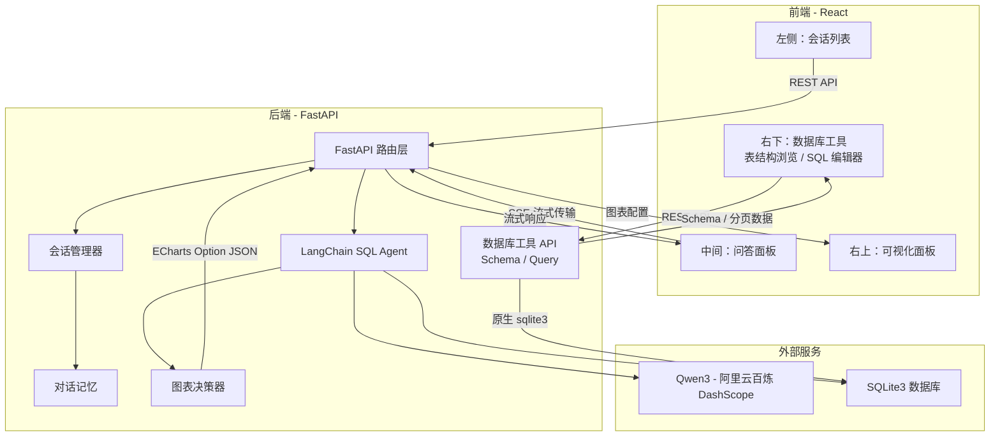
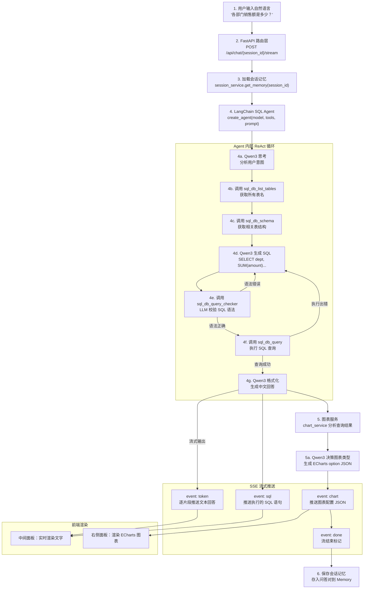
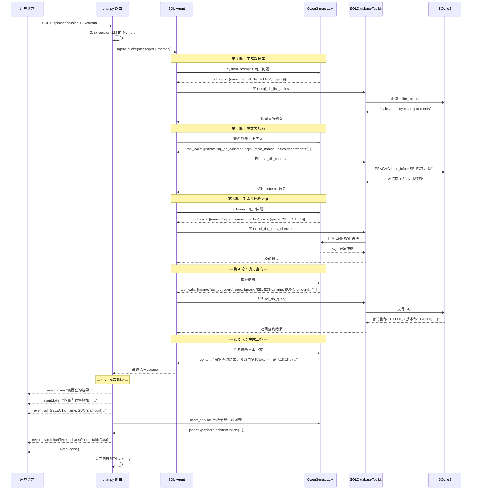
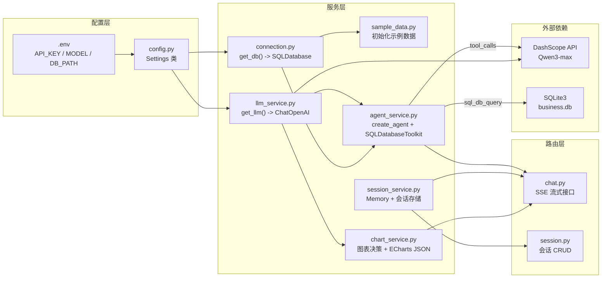
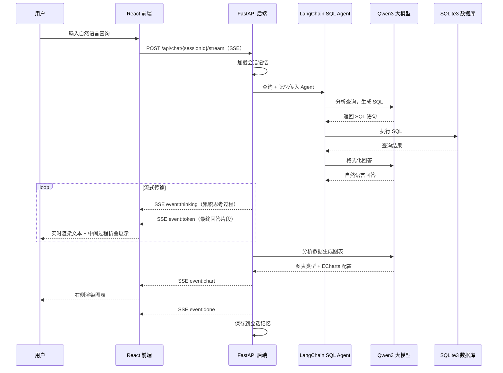

# NL2SQL 智能数据分析系统 - 分阶段开发计划

> **运行环境**：conda 虚拟环境 `nl2sql_vc`，Python 3.11
> **项目路径**：`g:\nl2sql_agent\`

---

## 系统整体架构




## 项目目录结构

```
g:\nl2sql_agent\
├── backend/
│   ├── app/
│   │   ├── __init__.py
│   │   ├── main.py                 # FastAPI 入口，CORS，挂载路由（session/chat/database）
│   │   ├── config.py               # 配置：API Key、DB 路径、模型参数
│   │   ├── routers/
│   │   │   ├── __init__.py
│   │   │   ├── chat.py             # 聊天接口（SSE 流式推送）
│   │   │   ├── session.py          # 会话 CRUD 接口
│   │   │   └── database.py         # [Phase5] 数据库工具 API（Schema + SQL 查询）
│   │   ├── services/
│   │   │   ├── __init__.py
│   │   │   ├── llm_service.py      # Qwen3 大模型初始化
│   │   │   ├── agent_service.py    # LangChain SQL Agent
│   │   │   ├── session_service.py  # 会话存储 + 对话记忆
│   │   │   └── chart_service.py    # 图表决策 + ECharts 配置
│   │   ├── models/
│   │   │   ├── __init__.py
│   │   │   └── schemas.py          # Pydantic 数据模型（含数据库工具相关）
│   │   ├── database/
│   │   │   ├── __init__.py
│   │   │   ├── connection.py       # SQLite + SQLDatabase 封装
│   │   │   └── sample_data.py      # 示例数据初始化
│   │   └── playground/             # 测试脚本
│   │       ├── test_qwen3.py       # Qwen3 接口实测
│   │       ├── test_nl2sql.py      # NL2SQL 组件实测
│   │       ├── test_phase3_api.py  # Phase3 API 测试
│   │       └── test_phase4_e2e.py  # Phase4 E2E 自动化测试
│   ├── requirements.txt
│   ├── .env                        # 环境变量（不提交 Git）
│   └── data/
│       └── business.db             # SQLite 数据库（不提交 Git）
├── frontend/
│   ├── src/
│   │   ├── App.tsx
│   │   ├── main.tsx
│   │   ├── index.css
│   │   ├── api/
│   │   │   └── client.ts           # API 客户端（REST + SSE + 数据库工具）
│   │   ├── types/
│   │   │   └── index.ts            # 类型定义（含 ColumnInfo/TableSchema/SqlQueryResult）
│   │   ├── stores/
│   │   │   ├── sessionStore.ts     # 会话状态（对接后端 REST API）
│   │   │   └── chatStore.ts        # 聊天状态（SSE 流式 + 消息加载）
│   │   └── components/
│   │       ├── AppLayout.tsx        # 三栏布局（右侧上下分割）
│   │       ├── Sidebar/
│   │       │   ├── SessionList.tsx  # 会话列表 + 新建
│   │       │   └── SessionItem.tsx  # 单个会话条目
│   │       ├── Chat/
│   │       │   ├── ChatPanel.tsx    # 聊天面板容器
│   │       │   ├── MessageList.tsx  # 消息列表（含流式渲染）
│   │       │   ├── MessageItem.tsx  # 消息气泡（含 SQL、图表、Markdown）
│   │       │   ├── ChatInput.tsx    # 输入区域
│   │       │   ├── MarkdownContent.tsx   # [Phase6] AI 回复 Markdown 渲染
│   │       │   └── CollapsibleProcess.tsx # [Phase6] 中间过程折叠
│   │       ├── Chart/
│   │       │   ├── ChartPanel.tsx   # 图表面板（图表/表格切换）
│   │       │   ├── DynamicChart.tsx # ECharts 渲染
│   │       │   └── DataTable.tsx    # 数据表格
│   │       └── Database/            # [Phase5] 数据库工具
│   │           ├── DatabasePanel.tsx # Tab 容器（表结构/SQL 查询）
│   │           ├── SchemaExplorer.tsx# 可折叠表结构浏览
│   │           ├── SqlEditor.tsx    # SQL 编辑器
│   │           └── QueryResult.tsx  # 分页查询结果展示
│   ├── package.json
│   └── vite.config.ts
├── sql_repo/                    # [Phase6] SQLite3 测试库
│   ├── init_db.py               # 初始化脚本，支持 --force 重建
│   ├── README.md
│   └── data/
│       └── test.db              # 测试数据库（不提交 Git）
├── .gitignore
└── README.md
```

---

## 任务清单总览


| Phase       | 任务 ID                  | 任务内容                                                                            | 状态          |
| ----------- | ---------------------- | ------------------------------------------------------------------------------- | ----------- |
| **Phase 1** | p1-backend-scaffold    | 后端基础骨架 - 目录结构、requirements.txt、.env、main.py、config.py，nl2sql_vc 环境安装依赖          | ✅ completed |
| **Phase 1** | p1-backend-run         | 启动后端服务验证 - uvicorn 启动，/api/health 和 /docs 正常                                    | ✅ completed |
| **Phase 1** | p1-frontend-scaffold   | 前端基础骨架 - Vite + React + TS，安装 Tailwind/zustand/echarts-for-react/axios，配置 proxy | ✅ completed |
| **Phase 1** | p1-frontend-run        | 启动前端服务验证 - npm run dev，页面可访问，proxy 代理 /api/health 正常                            | ✅ completed |
| **Phase 2** | p2-layout              | 前端三栏布局 - AppLayout（左 250px / 中 flex / 右 400px 上下分割）                             | ✅ completed |
| **Phase 2** | p2-sidebar             | 左侧边栏 UI - SessionList + SessionItem，新建/删除/高亮（mock 数据驱动）                         | ✅ completed |
| **Phase 2** | p2-chat-ui             | 中间聊天面板 UI - ChatPanel + MessageList + MessageItem + ChatInput（mock 数据驱动）        | ✅ completed |
| **Phase 2** | p2-chart-ui            | 右侧图表面板 UI - ChartPanel + DynamicChart + DataTable，ECharts 渲染 + 空状态占位            | ✅ completed |
| **Phase 2** | p2-stores              | Zustand 状态管理 - sessionStore + chatStore + TypeScript 类型定义（snake_case 对齐后端）      | ✅ completed |
| **Phase 3** | p3-llm-service         | 后端 LLM 服务 - Qwen3 via DashScope，ChatOpenAI 初始化 + 连通性测试                          | ✅ completed |
| **Phase 3** | p3-db-setup            | 后端数据库 - SQLite 连接 + SQLDatabase 封装 + 示例数据初始化（4 张业务表）                            | ✅ completed |
| **Phase 3** | p3-agent-service       | 后端 SQL Agent - create_agent + SQLDatabaseToolkit + InMemorySaver                | ✅ completed |
| **Phase 3** | p3-session-api         | 后端会话接口 - 会话 CRUD REST API（POST/GET/PUT/DELETE）                                  | ✅ completed |
| **Phase 3** | p3-chart-service       | 后端图表服务 - AI 图表类型决策 + ECharts option JSON 生成                                     | ✅ completed |
| **Phase 3** | p3-chat-stream-api     | 后端聊天流式接口 - SSE（token/sql/chart/done/error）                                      | ✅ completed |
| **Phase 4** | p4-api-client          | 前端 API 对接 - api/client.ts（Axios REST + Fetch SSE 流式封装），替换 mock                  | ✅ completed |
| **Phase 4** | p4-session-integration | 会话联调 - 左侧边栏对接后端会话 CRUD + 切换加载历史消息                                               | ✅ completed |
| **Phase 4** | p4-chat-integration    | 聊天联调 - 中间面板对接 SSE 流式接口 + 实时渲染 token/sql + 上下文记忆                                 | ✅ completed |
| **Phase 4** | p4-chart-integration   | 图表联调 - 右侧面板接收 SSE chart 事件，动态渲染 ECharts + 图表/表格切换                               | ✅ completed |
| **Phase 4** | p4-e2e-test            | 端到端验证 - 40 项自动化测试全部通过                                                           | ✅ completed |
| **Phase 5** | p5-db-backend-api      | 后端数据库工具 API - GET /api/database/schema + POST /api/database/query（分页）           | ✅ completed |
| **Phase 5** | p5-db-frontend-types   | 前端类型 + API - ColumnInfo/TableSchema/SqlQueryResult，fetchSchemaApi/executeSqlApi | ✅ completed |
| **Phase 5** | p5-db-schema-explorer  | SchemaExplorer 组件 - 可折叠表结构浏览，点击表名自动预填 SQL                                       | ✅ completed |
| **Phase 5** | p5-db-sql-editor       | SqlEditor + QueryResult 组件 - SQL 编辑器 + 分页结果展示（Ctrl+Enter 执行）                    | ✅ completed |
| **Phase 5** | p5-db-panel-layout     | DatabasePanel Tab 容器 + AppLayout 右侧栏改为上下分割（图表 + 数据库工具）                          | ✅ completed |
| **Phase 6** | p6-sqlite3-repo        | sql_repo - SQLite3 测试库 + init_db.py，REAL/INTEGER 类型，每表 100+ 行 mock 数据           | ✅ completed |
| **Phase 6** | p6-markdown            | AI 回复 Markdown 渲染 - react-markdown + remark-gfm                                 | ✅ completed |
| **Phase 6** | p6-collapsible         | 中间过程折叠 - CollapsibleProcess，流式时默认展开、完成后默认收缩                                     | ✅ completed |
| **Phase 6** | p6-thinking-process    | 思考过程优化 - SSE thinking 事件（question+answer 累积），持久化 thinking_process，前端实时展示 + 回显   | ✅ completed |
| **Phase 6** | p6-chart-ux            | 图表体验优化 - 对话内联图表、右侧查看大图、chartData 清空、chart_service 去 修复                          | ✅ completed |
| **Phase 6** | p6-tech-theme          | 科技主题 UI - CSS 变量、网格背景、青蓝 accent、右侧栏 520px、SQL 编辑器 6 行                           | ✅ completed |


---

## Phase 1：搭建前后端基础框架 + 运行验证

> **目标**：搭建前后端项目骨架，确保两端独立启动，前端 proxy 可访问后端。

### 1.1 后端骨架

- **环境**：`conda activate nl2sql_vc`（Python 3.11），后续所有后端操作均在此环境
- 创建 `backend/` 目录结构及所有 `__init__.py`
- `**requirements.txt**`：
  ```
  fastapi
  uvicorn[standard]
  langchain
  langchain-openai
  langchain-community
  python-dotenv
  pydantic
  pydantic-settings
  sse-starlette
  ```
- `**.env` 模板**：
  ```
  DASHSCOPE_API_KEY=sk-xxxxx
  LLM_MODEL_NAME=qwen3-max
  LLM_BASE_URL=https://dashscope.aliyuncs.com/compatible-mode/v1
  DB_PATH=./data/business.db
  ```
- `**config.py**`：pydantic-settings 读取 `.env`
- `**main.py**`：FastAPI 实例 + CORS（允许 `localhost:5173`）+ `/api/health` 返回 `{"status": "ok"}`
- 安装：`pip install -r requirements.txt`
- 启动：`uvicorn app.main:app --reload --port 8000`

### 1.2 前端骨架

- `npm create vite@latest frontend -- --template react-ts`
- 安装依赖：`npm install zustand axios echarts echarts-for-react uuid`，`npm install -D tailwindcss @tailwindcss/vite`
- `index.css` 引入 `@import "tailwindcss";`
- `vite.config.ts` 配置 `/api` -> `http://localhost:8000` 代理
- `App.tsx` 显示标题 + 调 `/api/health` 验证连通
- 启动：`npm run dev`

### Phase 1 验收标准

- 后端 8000 端口：`/api/health` 返回 200，`/docs` Swagger 可访问
- 前端 5173 端口：页面正常，proxy 调通 `/api/health`

---

## Phase 2：前端 UI 开发（Mock 数据驱动）

> **目标**：完成所有前端 UI 组件，用 mock 数据驱动，不依赖后端真实接口。

### 2.1 三栏布局（`AppLayout.tsx`）

```
+------------------+-------------------------+----------------------+
|                  |                         |  数据可视化（图表）     |
|  会话列表         |    聊天问答面板            |  ChartPanel          |
|  (w-[250px])     |    (flex-1)             |  (flex-1, min-h 240) |
|                  |                         +----------------------+
|                  |                         |  数据库工具            |
|                  |                         |  DatabasePanel       |
|                  |                         |  (flex-1, min-h 200) |
+------------------+-------------------------+----------------------+
                                              右侧 w-[520px] 上下分割
```

- Tailwind flex 布局，`h-screen`，各面板内部 `overflow-y-auto`
- 右侧栏宽 520px，上下等分：上半区 ChartPanel（数据可视化），下半区 DatabasePanel（表结构浏览 + SQL 编辑器）

### 2.2 左侧边栏 - 会话管理

- `SessionList.tsx`：顶部 "+ 新建会话" 按钮 + 可滚动会话列表
- `SessionItem.tsx`：会话标题 + 时间，当前高亮，hover 显示删除
- 用 `sessionStore` 本地 mock 数据驱动

### 2.3 中间面板 - 聊天问答

- `ChatPanel.tsx`：上方消息列表 + 下方输入区
- `MessageList.tsx`：消息容器，自动滚动到底
- `MessageItem.tsx`：用户消息右侧蓝色气泡 / AI 消息左侧灰色气泡
- `ChatInput.tsx`：多行输入框 + 发送按钮，Enter 发送 / Shift+Enter 换行
- mock 数据展示对话效果

### 2.4 右侧面板 - 图表可视化

- `ChartPanel.tsx`：图表容器 + 标题栏 + 图表/表格切换按钮
- `DynamicChart.tsx`：`echarts-for-react` 渲染，传入 option JSON，深色主题默认配置
- `DataTable.tsx`：表格数据展示组件
- 无数据：空状态占位（"查询数据后将在此展示图表"）
- 用 mock ECharts option 验证渲染

### 2.5 状态管理（Zustand）

- `types/index.ts`：`Session`、`Message`、`ChartData`、`ColumnInfo`、`TableSchema`、`SqlQueryResult` 类型
  - 所有字段采用 **snake_case** 命名，与后端 JSON 一致（如 `created_at`、`chart_type`、`echarts_option`、`table_data`）
- `sessionStore.ts`：`sessions[]`、`activeSessionId`、CRUD 方法（对接后端 REST API）
- `chatStore.ts`：`messages[]`、`isStreaming`、`streamingContent`、`streamingSql`、`chartData`、消息管理方法（对接后端 SSE）

### Phase 2 验收标准

- 三栏布局正确呈现
- 左侧可新建/切换/删除会话（本地 mock）
- 中间面板展示 mock 对话，输入框可交互
- 右侧面板渲染 mock ECharts 图表
- 所有交互通过 Zustand 驱动

---

## Phase 3：后端接口开发

> **目标**：实现所有后端业务逻辑和 API，可通过 Swagger `/docs` 独立测试。

### NL2SQL 完整数据调用流程图

#### 流程总览：从用户提问到图表渲染




#### Agent 内部 Tool Calling 循环（详细）




#### 组件依赖关系图




#### 关键数据结构流转

```
用户输入                    Agent 内部流转                              SSE 输出                前端状态
─────────────────────────────────────────────────────────────────────────────────────────────────────
"各部门销售额"  ──>  HumanMessage(content="...")
                         │
                         ▼
                    Qwen3 返回 AIMessage
                    tool_calls: [{
                      name: "sql_db_list_tables"   ──>  Toolkit 执行  ──>  "sales,departments,..."
                      args: {}
                    }]
                         │
                         ▼
                    Qwen3 返回 AIMessage
                    tool_calls: [{
                      name: "sql_db_schema"        ──>  Toolkit 执行  ──>  CREATE TABLE sales(...)
                      args: {table_names:"sales"}
                    }]
                         │
                         ▼
                    Qwen3 返回 AIMessage
                    tool_calls: [{
                      name: "sql_db_query"          ──>  Toolkit 执行  ──>  [("销售部",150000),...]
                      args: {query:"SELECT..."}
                    }]
                         │
                         ▼
                    Qwen3 返回 AIMessage             event:token     chatStore.messages[]
                    content: "各部门销售额..."  ────>  "各部门..."  ──>  实时追加渲染
                         │
                         ▼
                    chart_service 调用 Qwen3          event:chart     chatStore.chartData
                    返回: {                     ────>  JSON 推送  ──>  ChartPanel 渲染
                      chartType: "bar",
                      echartsOption: {xAxis,series...},
                      tableData: {columns,rows}
                    }
                         │
                         ▼
                                                     event:done      isStreaming = false
                                                ────>  {}       ──>  结束加载状态
```

---

### 3.0 Qwen3-max 接口字段规范（实测基准）

> 基于 `backend/app/playground/test_qwen3.py` 实测结果，以下为 LangChain `ChatOpenAI` 对接 DashScope 兼容端点的 **实际返回字段**，Phase 3 各服务模块必须据此处理输入输出。

#### A. 基础调用（invoke） —— 返回 `AIMessage`


| 字段                  | 类型     | 说明                                   |
| ------------------- | ------ | ------------------------------------ |
| `content`           | `str`  | 模型文本回复                               |
| `response_metadata` | `dict` | 含 7 个 key（见下）                        |
| `usage_metadata`    | `dict` | token 统计                             |
| `id`                | `str`  | LangChain run ID，格式 `"lc_run--xxxx"` |


`response_metadata` 内部字段：


| key                  | 示例值                                                                                                       | 说明                  |
| -------------------- | --------------------------------------------------------------------------------------------------------- | ------------------- |
| `token_usage`        | `{completion_tokens: 35, prompt_tokens: 14, total_tokens: 49, prompt_tokens_details: {cached_tokens: 0}}` | token 用量明细          |
| `model_name`         | `"qwen3-max"`                                                                                             | 模型名                 |
| `finish_reason`      | `"stop"`                                                                                                  | 结束原因                |
| `id`                 | `"chatcmpl-xxxx"`                                                                                         | DashScope 响应 ID     |
| `model_provider`     | `"openai"`                                                                                                | 提供商标识               |
| `system_fingerprint` | `null`                                                                                                    | 系统指纹（DashScope 不返回） |
| `logprobs`           | `null`                                                                                                    | 对数概率（DashScope 不返回） |


`usage_metadata` 内部字段：


| key                    | 示例值               |
| ---------------------- | ----------------- |
| `input_tokens`         | `14`              |
| `output_tokens`        | `35`              |
| `total_tokens`         | `49`              |
| `input_token_details`  | `{cache_read: 0}` |
| `output_token_details` | `{}`              |


#### B. 流式输出（stream） —— 逐 chunk 返回 `AIMessageChunk`


| 阶段       | `content`       | `response_metadata`          |
| -------- | --------------- | ---------------------------- |
| 首个 chunk | `""` (空字符串)     | `{model_provider: "openai"}` |
| 中间 chunk | `"文本片段"` (逐段递增) | `{}`                         |
| 末尾 chunk | `""` (空字符串)     | `{}`                         |


- SSE 对接要点：直接取 `chunk.content` 推送；空字符串 chunk 可跳过或由前端过滤
- 典型短回复约产生 **25-30 个 chunk**

#### C. 函数调用（Tool Calling） —— 返回 `AIMessage` 含 `tool_calls`

当模型决定调用工具时：

- `content` 为空字符串 `""`
- `tool_calls: list[dict]` —— 每个元素结构：


| 字段     | 类型     | 说明                          | 示例                 |
| ------ | ------ | --------------------------- | ------------------ |
| `name` | `str`  | 工具函数名                       | `"get_weather"`    |
| `args` | `dict` | 已解析的参数字典（**无需 JSON.parse**） | `{"city": "杭州"}`   |
| `id`   | `str`  | DashScope call ID           | `"call_54d820..."` |
| `type` | `str`  | 固定值                         | `"tool_call"`      |


关键特性：

- **支持并行调用**：单次响应可返回多个 `tool_calls`（实测成功返回 3 个并行工具调用）
- **流式 Tool Calling**：chunk 通过 `tool_call_chunks` 分片传输
  - 结构：`{name, args(增量字符串), id, index, type: "tool_call_chunk"}`
  - 聚合后与非流式 `tool_calls` 结构一致
- `additional_kwargs`：`{refusal: null}`

### 3.0.1 NL2SQL 组件接口规范（实测基准）

> 基于 `backend/app/playground/test_nl2sql.py` 实测结果，以下为 LangChain NL2SQL 全链路组件的 **实际输入输出接口**，Phase 3 开发必须据此实现。

#### A. SQLDatabase 基础接口


| 方法                                  | 输入                    | 输出类型          | 输出格式                                     |
| ----------------------------------- | --------------------- | ------------- | ---------------------------------------- |
| `SQLDatabase.from_uri(uri)`         | `"sqlite:///path.db"` | `SQLDatabase` | 数据库连接实例                                  |
| `db.dialect`                        | --                    | `str`         | `"sqlite"`                               |
| `db.get_usable_table_names()`       | --                    | `list[str]`   | `['departments', 'employees', 'sales']`  |
| `db.get_table_info()`               | --                    | `str`         | CREATE TABLE DDL + 每表 3 行示例数据（约 1000 字符） |
| `db.run(sql)`                       | SQL 字符串               | `str`         | 元组列表字符串：`"[('销售部', 150000.0)]"`          |
| `db.run(sql, include_columns=True)` | SQL + 参数              | `str`         | 字典列表字符串：`"[{'dept': '销售部', 'cnt': 4}]"`  |


`get_table_info()` 输出示例：

```
CREATE TABLE employees (
    id INTEGER, name TEXT NOT NULL, department_id INTEGER,
    position TEXT, salary REAL, hire_date TEXT,
    PRIMARY KEY (id),
    FOREIGN KEY(department_id) REFERENCES departments (id)
)
/*
3 rows from employees table:
id  name  department_id  position  salary  hire_date
1   张三  1              部门经理  25000.0 2020-03-15
2   李四  2              部门经理  30000.0 2019-06-01
3   王五  3              部门经理  22000.0 2021-01-10
*/
```

#### B. SQLDatabaseToolkit 四个工具（实测接口）

```python
from langchain_community.agent_toolkits import SQLDatabaseToolkit

toolkit = SQLDatabaseToolkit(db=db, llm=model)
tools = toolkit.get_tools()  # 返回 4 个工具
```


| 工具名                    | 工具类型                   | args_schema                 | 输入示例                              | 输出示例                              |
| ---------------------- | ---------------------- | --------------------------- | --------------------------------- | --------------------------------- |
| `sql_db_list_tables`   | `ListSQLDatabaseTool`  | `{tool_input: str}` (默认空)   | `""`                              | `"departments, employees, sales"` |
| `sql_db_schema`        | `InfoSQLDatabaseTool`  | `{table_names: str}` (逗号分隔) | `"departments, employees"`        | DDL + 示例行（622 字符）                 |
| `sql_db_query_checker` | `QuerySQLCheckerTool`  | `{query: str}`              | `"SELECT name FROM..."`           | 校验后的 SQL 原文                       |
| `sql_db_query`         | `QuerySQLDatabaseTool` | `{query: str}`              | `"SELECT d.name, COUNT(e.id)..."` | `"[('人事部', 1), ('销售部', 4)]"`      |


关键细节：

- 所有工具输出均为 `**str` 类型**（非结构化），后端如需结构化数据须自行 `eval()` 或 `json.loads()` 解析
- `sql_db_query_checker` 实际调用 LLM 审查 SQL 语法，若正确则原样返回
- `sql_db_list_tables` 的输入参数名为 `tool_input`，值为空字符串

#### C. create_agent 返回结构（实测）

```python
from langchain.agents import create_agent
from langgraph.checkpoint.memory import InMemorySaver

agent = create_agent(model, tools, system_prompt=prompt, checkpointer=InMemorySaver())
```

**invoke 返回值**：`dict`，唯一 key 为 `"messages"`

```python
result = agent.invoke(
    {"messages": [{"role": "user", "content": "问题"}]},
    config={"configurable": {"thread_id": "session-id"}},
)
# result["messages"] -> List[BaseMessage]
```

**messages 列表结构**（实测 10 条，4 轮工具调用）：


| 索引  | 类型             | 内容          | 关键字段                                                                         |
| --- | -------------- | ----------- | ---------------------------------------------------------------------------- |
| 0   | `HumanMessage` | 用户原始问题      | `content`                                                                    |
| 1   | `AIMessage`    | 思考 + 决定列表   | `content` + `tool_calls:[{name:"sql_db_list_tables"}]`                       |
| 2   | `ToolMessage`  | 表名列表        | `content:"departments, employees, sales"`, `name:"sql_db_list_tables"`       |
| 3   | `AIMessage`    | 思考 + 查结构    | `content` + `tool_calls:[{name:"sql_db_schema", args:{table_names:"..."}}]`  |
| 4   | `ToolMessage`  | 表结构 DDL     | `content`, `name:"sql_db_schema"`                                            |
| 5   | `AIMessage`    | 思考 + 校验 SQL | `content` + `tool_calls:[{name:"sql_db_query_checker", args:{query:"..."}}]` |
| 6   | `ToolMessage`  | 校验结果        | `content`, `name:"sql_db_query_checker"`                                     |
| 7   | `AIMessage`    | 执行 SQL      | `tool_calls:[{name:"sql_db_query", args:{query:"SELECT..."}}]`               |
| 8   | `ToolMessage`  | 查询结果        | `content:"[(10,)]"`, `name:"sql_db_query"`                                   |
| 9   | `AIMessage`    | **最终中文回答**  | `content:"公司一共有10名员工..."` (无 tool_calls)                                     |


**实测工具调用链**：`sql_db_list_tables` -> `sql_db_schema` -> `sql_db_query_checker` -> `sql_db_query`

#### D. 流式输出接口（stream_mode="updates"）

```python
for event in agent.stream(
    {"messages": [{"role": "user", "content": "问题"}]},
    config={"configurable": {"thread_id": "xxx"}},
    stream_mode="updates",
):
    for node_name, node_data in event.items():
        # node_name: "model" 或 "tools"
        # node_data: {"messages": [BaseMessage]}
```

每个事件结构为 `{node_name: {"messages": [...]}}`:


| 事件节点      | 包含的消息类型       | 内容                      | 次数（实测） |
| --------- | ------------- | ----------------------- | ------ |
| `"model"` | `AIMessage`   | 思考文本 + tool_calls 或最终回答 | 5 次    |
| `"tools"` | `ToolMessage` | 工具执行结果                  | 4 次    |


SSE 对接映射：

- `node="model"` + `msg.content` 非空且无 `tool_calls` -> `event: token`（最终回答）
- `node="model"` + `msg.tool_calls` 含 `sql_db_query` -> 提取 SQL 用于 `event: sql`
- `node="tools"` + `msg.name="sql_db_query"` -> 提取查询结果用于图表生成
- 全部事件结束 -> `event: done`

#### E. 多轮对话记忆接口（实测）

```python
from langgraph.checkpoint.memory import InMemorySaver

agent = create_agent(model, tools, prompt, checkpointer=InMemorySaver())
thread_config = {"configurable": {"thread_id": "session-123"}}
```


| 特性                    | 实测结果                                          |
| --------------------- | --------------------------------------------- |
| 同 thread 追问 "他们的平均工资" | 正确关联到上轮的 "销售部"，回答 "16,500元"                   |
| 新 thread 同样追问         | 回复 "请您提供更多上下文信息"                              |
| messages 累积           | 第 1 轮 14 条 -> 第 2 轮 20 条 -> 第 3 轮 26 条（每轮 +6） |
| 隔离性                   | thread_id 不同的会话完全隔离                           |


**注意**：messages 随对话轮次线性增长，长期使用需配合消息裁剪策略（trim_messages）。

### 3.1 大模型服务（`llm_service.py`）

- `ChatOpenAI` from `langchain-openai`，`base_url` 指向 DashScope 兼容端点
- 模型名：`qwen3-max`（已通过 `playground/test_qwen3.py` 实测验证）
- `api_key` 从 `.env` 读取（`DASHSCOPE_API_KEY`）
- `get_llm(streaming=False)` 工厂函数，支持 streaming 参数切换
- 初始化参数：`temperature=0.7`

### 3.2 数据库搭建（`connection.py` + `sample_data.py`）

- `SQLDatabase.from_uri("sqlite:///data/business.db")`
- 示例数据表 + 测试数据（等用户提供表结构后填充）
- `get_db()` 工厂函数

### 3.3 SQL Agent（`agent_service.py`）

- `create_agent(llm, tools, system_prompt, checkpointer)` -- LangChain v1 新版 API（已通过 `playground/test_nl2sql.py` 实测验证）
- 工具集：`SQLDatabaseToolkit(db=db, llm=llm).get_tools()` -- 4 个工具
- 记忆：`InMemorySaver` 作为 checkpointer，通过 `thread_id` 隔离会话（替代旧版 `ConversationBufferWindowMemory`）
- 自定义 system prompt：先查表结构 -> 生成 SQL -> checker 校验 -> 执行 -> 中文回答 -> 附带 SQL
- 实测工具调用链：`list_tables` -> `schema` -> `query_checker` -> `query`（共 4 轮，产生 10 条 messages）

### 3.4 会话管理接口（`session.py` + `session_service.py`）

- 内存字典存储，每会话独立 Memory
- `POST /api/sessions` - 新建
- `GET /api/sessions` - 列表
- `GET /api/sessions/{id}` - 详情 + 消息
- `DELETE /api/sessions/{id}` - 删除
- `PUT /api/sessions/{id}` - 更新标题

### 3.5 图表服务（`chart_service.py`）

- 接收查询结果 + 用户问题 -> 调 Qwen3 生成 `{chartType, echartsOption}`
- `json.loads()` 解析校验
- 异常降级：解析失败返回 `chartType: "table"` + 原始数据

### 3.6 聊天流式接口（`chat.py`）

- `POST /api/chat/{session_id}/stream`，请求体 `{"message": "..."}`
- SSE 事件流：`event: thinking` / `event: token` / `event: sql` / `event: chart` / `event: done`
- 流程：加载记忆 -> Agent 执行 -> 流式输出（thinking 累积 + token 回答）-> 图表生成 -> 保存记忆（含 thinking_process）

**SSE 事件与 Qwen3 返回字段映射：**


| SSE 事件            | 数据来源                     | 字段取值                                         | 前端处理                        |
| ----------------- | ------------------------ | -------------------------------------------- | --------------------------- |
| `event: token`    | `AIMessageChunk.content` | 非空字符串片段（跳过空 chunk）                           | 追加到消息文本，实时渲染                |
| `event: sql`      | Agent 中间步骤               | 执行的 SQL 语句字符串                                | 可选展示查询语句                    |
| `event: thinking` | Agent 中间步骤 + 用户问题 + 回答   | 全量累积 Markdown（question+推理+answer，`\n\n` 拼接）  | 替换 `streamingThinking`，实时渲染 |
| `event: chart`    | `chart_service` 后处理结果    | `{chartType, echartsOption, tableData}` JSON | 更新右侧图表面板                    |
| `event: done`     | 流结束标记                    | `{}`                                         | 结束 streaming 状态             |
| `event: error`    | 异常捕获                     | `{message: "错误描述"}`                          | 展示错误提示                      |


**流式输出实现要点（基于 3.0 实测结论）：**

- 遍历 `llm.stream()` 返回的 `AIMessageChunk`，取 `chunk.content` 作为 `event: token` 的 `data`
- 首尾 chunk 的 `content` 为空字符串，应过滤后再推送
- Agent 的 `tool_calls` 由 LangChain Agent 框架内部自动处理（查表结构、执行 SQL），无需手动解析 `tool_call_chunks`
- 最终文本回复通过 `event: token` 流式输出，图表通过 `event: chart` 一次性推送

### Phase 3 验收标准

- Swagger `/docs` 可测试所有接口
- 会话 CRUD 正常
- 聊天接口：自然语言 -> SQL 查询 -> 流式结果
- 图表配置正确生成
- 追问场景下 Agent 理解上下文

---

## Phase 4：前后端联调

> **目标**：前端 mock 替换为真实接口，实现完整端到端功能闭环。

### 4.1 API 客户端（`api/client.ts`）

- Axios 实例：`baseURL: /api`，统一错误拦截
- SSE 封装：`fetch` + `ReadableStream` 解析 5 种事件类型（`token`/`sql`/`chart`/`done`/`error`）
- 按 SSE 协议 `\n\n` 分割事件，解析 `event:` 和 `data:` 行

### 4.2 会话联调

- `sessionStore` 所有方法改为调后端 REST API：`createSessionApi`、`fetchSessionsApi`、`deleteSessionApi`、`updateSessionTitleApi`
- 左侧边栏对接新建/删除/切换，切换时调 `getSessionDetailApi` 加载历史消息
- 前端字段名全部对齐后端 snake_case（`created_at`、`updated_at`、`message_count`）

### 4.3 聊天联调

- `chatStore.sendMessage()` 调 SSE 流式接口 `sendChatMessageApi`
- 流式状态管理：`isStreaming`、`streamingContent`（累积 token）、`streamingSql`（SQL 语句）
- `MessageList` 实时渲染流式 token + 打字光标动画 + "AI 正在思考中" 动画
- `MessageItem` 内展示 Agent 执行的 SQL（代码块样式）
- 验证连续追问上下文记忆

### 4.4 图表联调

- 收 SSE `chart` 事件 -> 更新 `chatStore.chartData`
- `ChartPanel` 监听变化，自动渲染 ECharts 或 DataTable
- 图表/表格切换按钮（当同时有 echarts_option 和 table_data 时显示）
- 字段对齐：`chart_type`（非 chartType）、`echarts_option`（非 echartsOption）、`table_data`（非 tableData）

### 4.5 端到端验证（`playground/test_phase4_e2e.py`）

自动化测试脚本覆盖 **40 项检查**：

1. 健康检查：`GET /api/health` 返回 200
2. 会话 CRUD：创建 / 列表 / 详情 / 更新标题 / 删除
3. SSE 流式聊天：token 事件、sql 事件、chart 事件、done 事件完整性
4. 多轮对话：追问上下文理解（同一 session 的 thread_id 隔离）
5. 会话隔离：不同 session 上下文独立
6. 消息持久化：发送后再次拉取会话详情，消息正确存储

### Phase 4 验收标准

- ✅ 所有前端功能对接真实后端
- ✅ SSE 流式渲染流畅（token + sql + chart 三类事件）
- ✅ 图表根据数据自动渲染，类型 AI 决定
- ✅ 会话管理完整（CRUD + 历史消息加载）
- ✅ 上下文记忆正常（InMemorySaver + thread_id）
- ✅ 40 项自动化 E2E 测试全部通过

---

## Phase 5：数据库工具（右侧下半区）

> **目标**：在右侧面板下方新增数据库浏览和手动 SQL 查询功能，突破 NL2SQL Agent 的 100 条查询限制，让用户可以直接探索数据库结构和执行任意 SELECT 查询。

### 5.1 后端 API（`routers/database.py`）

#### GET `/api/database/schema` — 获取所有表结构

- 使用原生 `sqlite3.connect()` 直接连接数据库（绕过 LangChain SQLDatabase 限制）
- 查询 `sqlite_master` 获取所有用户表
- 对每张表执行 `PRAGMA table_info()` 获取列信息
- 返回：`SchemaResponse { tables: TableSchema[] }`

#### POST `/api/database/query` — 执行 SQL 查询（分页）

- 请求体：`SqlQueryRequest { sql, page=1, page_size=50 }`
- 安全校验：仅允许 `SELECT` 语句，正则过滤 INSERT/UPDATE/DELETE/DROP 等写操作
- 分页实现：`SELECT COUNT(*) FROM (用户SQL)` + `LIMIT/OFFSET`
- 返回：`SqlQueryResponse { columns, rows, total_count, page, page_size, total_pages, elapsed_ms }`

#### Pydantic 模型（`models/schemas.py` 新增）

```python
class ColumnInfo(BaseModel):
    name: str         # 列名
    type: str         # 列类型（INTEGER/TEXT/REAL 等）
    primary_key: bool # 是否主键
    nullable: bool    # 是否可空

class TableSchema(BaseModel):
    name: str                    # 表名
    columns: list[ColumnInfo]    # 列列表

class SchemaResponse(BaseModel):
    tables: list[TableSchema]

class SqlQueryRequest(BaseModel):
    sql: str                     # SQL 语句（仅 SELECT）
    page: int = 1                # 页码
    page_size: int = 50          # 每页条数（1-500）

class SqlQueryResponse(BaseModel):
    columns: list[str]           # 列名列表
    rows: list[list[Any]]        # 行数据
    total_count: int             # 总行数
    page: int                    # 当前页码
    page_size: int               # 每页条数
    total_pages: int             # 总页数
    elapsed_ms: int              # 执行耗时（毫秒）
```

### 5.2 前端类型 + API（`types/index.ts` + `api/client.ts`）

- 新增 TypeScript 类型：`ColumnInfo`、`TableSchema`、`SqlQueryResult`
- 新增 API 方法：
  - `fetchSchemaApi()` → `GET /api/database/schema`
  - `executeSqlApi(sql, page, pageSize)` → `POST /api/database/query`

### 5.3 SchemaExplorer 组件（`Database/SchemaExplorer.tsx`）

- 页面加载时调 `fetchSchemaApi()` 获取所有表结构
- 可折叠的表名列表，默认展开第一张表
- 展开后显示表格：列名、类型、约束（PK / NOT NULL）
- 每行 hover 显示 `SELECT` 快捷按钮，点击后自动切换到 SQL Tab 并预填 `SELECT * FROM table LIMIT 50`
- 加载失败时显示重试按钮

### 5.4 SqlEditor 组件（`Database/SqlEditor.tsx`）

- 多行 textarea，`font-mono` 等宽字体
- 支持 `Ctrl+Enter`（或 `Cmd+Enter`）快捷执行
- "执行查询" + "清空" 按钮
- 接收来自 SchemaExplorer 的预填 SQL（通过 `useEffect` 避免渲染中更新 state）
- 执行时调 `executeSqlApi()`，显示 loading 状态
- 错误信息以红色提示框展示

### 5.5 QueryResult 组件（`Database/QueryResult.tsx`）

- 表头固定（`sticky top-0`），表体可滚动
- 斑马纹行样式，NULL 值以灰色斜体显示
- 数字自动千分位格式化
- 底部分页栏：总条数、每页条数、耗时、上一页/下一页按钮、当前页/总页数

### 5.6 DatabasePanel 容器（`Database/DatabasePanel.tsx`）

- Tab 切换：「表结构」/「SQL 查询」
- SchemaExplorer 点击表名 → 自动切到 SQL Tab 并预填查询
- 通过 `useCallback` 管理预填 SQL 状态

### 5.7 AppLayout 改造

- 右侧 `<aside>` 改为 flex-col 上下分割
- 上半区：`ChartPanel`（flex-1, min-h-[240px]）
- 下半区：`DatabasePanel`（flex-1, min-h-[200px]）
- 两区均设 `overflow-hidden` 防止溢出

### Phase 5 验收标准

- ✅ GET /api/database/schema 正确返回所有表结构
- ✅ POST /api/database/query 支持分页查询，仅允许 SELECT
- ✅ 右侧上半区图表面板功能不变
- ✅ 右侧下半区「表结构」Tab 正确展示可折叠表结构
- ✅ 右侧下半区「SQL 查询」Tab 可执行 SQL 并分页浏览结果
- ✅ 点击表名 SELECT 按钮自动跳转 SQL Tab 并预填查询
- ✅ TypeScript 编译零错误

---

## Phase 6：SQLite3 版本体验优化（v1.0.0-sqlite3）

> **目标**：完善 SQLite3 版本的用户体验，包括 Markdown 渲染、图表展示、中间过程折叠、科技主题 UI 等，并打 v1.0.0-sqlite3 版本标签推送到 GitHub。

### 6.1 sql_repo 测试库（`sql_repo/`）

- `init_db.py`：初始化 SQLite3 测试库，四张表（departments, employees, products, sales）
- 字段类型：金额/价格/薪资使用 REAL/INTEGER
- 每表 100+ 条 mock 数据，支持 `--force` 重建
- `backend/.env` 中 `DB_PATH` 指向 `sql_repo/data/test.db`

### 6.2 AI 回复 Markdown 渲染

- 安装 `react-markdown` + `remark-gfm`
- `MarkdownContent.tsx`：统一 Markdown 渲染组件，深色主题样式
- `MessageItem` 中 AI 消息、`MessageList` 中流式气泡均使用 Markdown 渲染
- 支持：段落、列表、加粗、代码块、链接、表格等

### 6.3 中间过程折叠

- `CollapsibleProcess.tsx`：可折叠区块，标题「中间过程」，小箭头图标
- 默认收缩，点击展开
- `MessageItem` 中 SQL 放入折叠块；`MessageList` 流式时「思考中」+ SQL 放入折叠块

### 6.3.1 思考过程优化（thinking_process）

> **需求**：中间过程折叠块内展示完整思考过程（用户问题 + AI 推理步骤 + 最终回答），而非仅展示 SQL 语句；思考过程在生成过程中实时追加累积。

**后端改动：**

- `**chat.py**` — `_stream_agent_response()` 新增 `event: thinking` SSE 事件：
  - 初始发送 `**用户问题**：{message}` 作为首条 thinking 事件
  - `AIMessage` 含 content 时发送 `**思考**：{content}`（含 tool_calls 时附带工具调用摘要）
  - `ToolMessage` 按工具名分类发送摘要（`**查询表列表**`、`**获取表结构**`、`**执行SQL查询**` 等）
  - 最终回答时同步发送 `**最终回答**：{answer}`
  - 每次 thinking 事件的 `data` 包含截至当前的 **全量累积内容**（`\n\n` 拼接）
- `**session_service.py**` — `add_message()` 新增 `thinking_process: Optional[str]` 参数，持久化到消息字典
- `**schemas.py**` — `MessageItem` 新增 `thinking_process: Optional[str]` 字段

**前端改动：**

- `**types/index.ts**` — `Message` 接口新增 `thinking_process?: string | null`
- `**api/client.ts**` — `SSECallbacks` 新增 `onThinking` 回调；SSE 解析新增 `case 'thinking'` 分支
- `**chatStore.ts**` — 新增 `streamingThinking` 状态；`onThinking` 回调更新累积内容；`onDone` 时写入 `thinking_process` 字段；`loadSessionMessages` 回显历史 `thinking_process`
- `**MessageList.tsx**` — 流式时 `CollapsibleProcess` 内展示 `streamingThinking`（Markdown 渲染），无内容时显示「AI 正在思考中...」
- `**MessageItem.tsx**` — 历史消息 `CollapsibleProcess` 优先展示 `thinking_process`，兼容回退到 `sql`

**SSE 事件格式：**


| SSE 事件            | 数据来源                   | 字段取值                           | 前端处理                        |
| ----------------- | ---------------------- | ------------------------------ | --------------------------- |
| `event: thinking` | Agent 中间步骤 + 用户问题 + 回答 | 全量累积 Markdown 文本（`\n\n` 拼接各步骤） | 替换 `streamingThinking`，实时渲染 |


### 6.4 图表体验优化

- 对话内联图表：AI 消息气泡内直接展示柱状图/折线图/表格
- 「在右侧查看大图」：点击后 ChartPanel 自动切回图表视图
- 切换会话或发送新消息时清空 `chartData`，避免残留
- `chart_service.py`：去除 Qwen3 `<think>` 标签、兜底 JSON 提取，确保 echarts_option 正确解析

### 6.5 科技主题 UI

- `index.css`：CSS 变量（`--tech-bg-*`、`--tech-border`、`--tech-accent` 等）、网格背景、青蓝 accent 滚动条
- 全局深蓝黑底、青蓝边框与强调色
- 右侧栏 520px，SQL 编辑器 `rows={6}`

### Phase 6 验收标准

- ✅ sql_repo 可独立初始化测试库
- ✅ AI 回复支持 Markdown 格式展示
- ✅ 中间过程（SQL、思考中）可折叠收缩
- ✅ 思考过程完整展示：用户问题 + AI 推理步骤 + 最终回答（非仅 SQL）
- ✅ 思考过程实时追加累积，流式期间可展开查看当前进度
- ✅ 思考过程持久化到会话，切换会话后历史消息可回显 thinking_process
- ✅ 图表在对话气泡内联展示，点击「在右侧查看大图」切至右侧图表
- ✅ 切换会话或新问题时无图表残留
- ✅ 科技主题全局生效（背景、边框、accent）
- ✅ v1.0.0-sqlite3 标签已推送到 GitHub

---

## 数据流转（全生命周期）




---

## 核心依赖

### 后端（requirements.txt）

- `fastapi` + `uvicorn[standard]`
- `langchain` + `langchain-openai` + `langchain-community`
- `python-dotenv`
- `pydantic` + `pydantic-settings`
- `sse-starlette`

### 前端（package.json）

- `react` + `react-dom` + `vite` + `typescript`
- `tailwindcss` + `@tailwindcss/vite`
- `zustand`
- `echarts` + `echarts-for-react`
- `axios` + `uuid`
- `react-markdown` + `remark-gfm`（Phase 6 Markdown 渲染）

